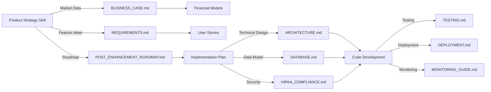

# Product Strategy Session Skill — Integration with CareSync Documentation

**Last Updated**: March 13, 2026  
**Skill Version**: 1.0  
**Integration Status**: Active  
**Related Codebase Version**: 1.2.1 (Latest stable with error fixes)

---

## Overview

This document shows how the **product-strategy-session** skill integrates with CareSync's existing documentation and how to leverage both for product development, strategic planning, and stakeholder alignment.

## How This Skill Works with CareSync Documentation

### 1. Market & Business Context
The skill provides frameworks for developing go-to-market strategy, while CareSync's documentation provides implementation details.

| CareSync Doc | Skill Integration | Use Case |
|--------------|-------------------|----------|
| [BUSINESS_CASE.md](../../docs/BUSINESS_CASE.md) | Baseline for financial models | Reference for revenue assumptions |
| [REQUIREMENTS.md](../../docs/REQUIREMENTS.md) | User stories and features | Input for feature prioritization |
| [FEATURES.md](../../docs/FEATURES.md) | Current feature set | Baseline for roadmap development |

**Example Workflow**:
```
1. Run skill: /product-strategy-session — Develop revenue models for 2026-2027
   ↓ (Output: 3-year financial projections, pricing models)
2. Reference [BUSINESS_CASE.md](../../docs/BUSINESS_CASE.md) for investment theses
3. Update [POST_ENHANCEMENT_ROADMAP.md](../../docs/POST_ENHANCEMENT_ROADMAP.md) with strategy alignment
```

### 2. Technical Architecture & Implementation
The skill helps plan what to build, while the architecture docs specify how to build it.

| CareSync Doc | Skill Integration | Use Case |
|--------------|-------------------|----------|
| [ARCHITECTURE.md](../../docs/ARCHITECTURE.md) | Technical constraints | Know what's possible |
| [DATABASE.md](../../docs/DATABASE.md) | Data model | Feature data requirements |
| [API.md](../../docs/API.md) | Available endpoints | Integration points |

**Example Workflow**:
```
1. Skill creates: Feature prioritization matrix
2. Review [ARCHITECTURE.md](../../docs/ARCHITECTURE.md) for technical constraints
3. Check [DATABASE.md](../../docs/DATABASE.md) for data model compatibility
4. Confirm API availability in [API.md](../../docs/API.md)
5. Update roadmap implementation timeline
```

### 3. Clinical & Regulatory Compliance
The skill understands healthcare workflows, while CareSync docs ensure compliance.

| CareSync Doc | Skill Integration | Use Case |
|--------------|-------------------|----------|
| [HIPAA_COMPLIANCE.md](../../docs/HIPAA_COMPLIANCE.md) | Data privacy constraints | Feature design boundaries |
| [SECURITY.md](../../docs/SECURITY.md) | Security requirements | Compliance built-in |
| [REQUIREMENTS.md](../../docs/REQUIREMENTS.md) | Clinical workflows | Workflow design patterns |

**Example Workflow**:
```
1. Skill drafts: Patient engagement feature strategy
   ↓ (Output: User segments, messaging, engagement mechanics)
2. Reference [HIPAA_COMPLIANCE.md](../../docs/HIPAA_COMPLIANCE.md) for data handling
3. Review [SECURITY.md](../../docs/SECURITY.md) for authentication/encryption
4. Align with clinical workflows in [REQUIREMENTS.md](../../docs/REQUIREMENTS.md)
5. Document compliance requirements in [IMPLEMENTATION_GUIDE.md](../../docs/IMPLEMENTATION_GUIDE.md)
```

### 4. Deployment & Operations
The skill helps plan scaling strategy, while CareSync docs ensure operational readiness.

| CareSync Doc | Skill Integration | Use Case |
|--------------|-------------------|----------|
| [DEPLOYMENT.md](../../docs/DEPLOYMENT.md) | Infrastructure strategy | Scaling requirements |
| [MONITORING_GUIDE.md](../../docs/MONITORING_GUIDE.md) | Operational metrics | SLAs for new features |
| [DISASTER_RECOVERY_PLAN_FINAL.md](../../docs/DISASTER_RECOVERY_PLAN_FINAL.md) | Availability targets | Feature availability SLOs |

**Example Workflow**:
```
1. Skill creates: Geographic expansion roadmap
   ↓ (Output: Timeline, infrastructure needs, compliance per region)
2. Reference [DEPLOYMENT.md](../../docs/DEPLOYMENT.md) for current infrastructure
3. Plan deployment in [DEPLOYMENT.md](../../docs/DEPLOYMENT.md)
4. Define monitoring in [MONITORING_GUIDE.md](../../docs/MONITORING_GUIDE.md)
5. Validate disaster recovery in [DISASTER_RECOVERY_PLAN_FINAL.md](../../docs/DISASTER_RECOVERY_PLAN_FINAL.md)
```

### 5. Code Quality & Stability
The skill informs feature priorities while CareSync docs ensure quality implementation.

| CareSync Doc | Skill Integration | Use Case |
|--------------|-------------------|----------|
| [PRIOR_ERROR_RESOLUTION_REPORT.md](../../docs/PRIOR_ERROR_RESOLUTION_REPORT.md) | Technical debt inventory | Prioritization input |
| [COMPREHENSIVE_DEVELOPER_ENHANCEMENT_PLAN.md](../../docs/COMPREHENSIVE_DEVELOPER_ENHANCEMENT_PLAN.md) | Enhancement framework | Feature implementation guide |
| [TESTING.md](../../docs/TESTING.md) | Test requirements | Quality gates for features |

---

## Complete Documentation Reference

### Strategic Documents
These provide context for strategy development and market analysis.

- **[BUSINESS_CASE.md](../../docs/BUSINESS_CASE.md)** — Market opportunity, revenue models, financial projections
- **[REQUIREMENTS.md](../../docs/REQUIREMENTS.md)** — User stories, functional requirements by role
- **[FEATURES.md](../../docs/FEATURES.md)** — Feature inventory, current capabilities
- **[POST_ENHANCEMENT_ROADMAP.md](../../docs/POST_ENHANCEMENT_ROADMAP.md)** — Product roadmap (2-3 years)

### Technical Architecture
These define what's technically possible and constraints.

- **[ARCHITECTURE.md](../../docs/ARCHITECTURE.md)** — System architecture, component layout
- **[DATABASE.md](../../docs/DATABASE.md)** — Data model, table schemas, relationships
- **[API.md](../../docs/API.md)** — API endpoints, authentication, rate limits
- **[IMPLEMENTATION_GUIDE.md](../../docs/IMPLEMENTATION_GUIDE.md)** — Development patterns, standards

### Clinical & Compliance
These ensure healthcare-specific requirements are met.

- **[HIPAA_COMPLIANCE.md](../../docs/HIPAA_COMPLIANCE.md)** — Data privacy, access controls, encryption
- **[SECURITY.md](../../docs/SECURITY.md)** — Security architecture, threat model, mitigations
- **[REQUIREMENTS.md](../../docs/REQUIREMENTS.md)** — Clinical workflows by role
- **[ROLE_ASSIGNMENT_GUIDE.md](../../docs/ROLE_ASSIGNMENT_GUIDE.md)** — User role definitions and permissions

### Operations & Maintenance
These cover deployment, monitoring, and ongoing operations.

- **[DEPLOYMENT.md](../../docs/DEPLOYMENT.md)** — Release process, environments, scaling
- **[MONITORING_GUIDE.md](../../docs/MONITORING_GUIDE.md)** — Metrics, alerting, dashboards
- **[DISASTER_RECOVERY_PLAN_FINAL.md](../../docs/DISASTER_RECOVERY_PLAN_FINAL.md)** — Backup, recovery, RTO/RPO
- **[MAINTENANCE.md](../../docs/MAINTENANCE.md)** — Database maintenance, performance tuning

### Testing & Quality
These ensure features meet quality standards.

- **[TESTING.md](../../docs/TESTING.md)** — Test strategy, E2E flows, accessibility
- **[ACCESSIBILITY_AUDIT_2026-03-11.md](../../docs/ACCESSIBILITY_AUDIT_2026-03-11.md)** — WCAG compliance, accessibility standards
- **[CODE_REVIEW_REPORT_2026-03-11.md](../../docs/CODE_REVIEW_REPORT_2026-03-11.md)** — Code quality standards

### Error Prevention & Reliability
These document recent improvements and lessons learned.

- **[PRIOR_ERROR_RESOLUTION_REPORT.md](../../docs/PRIOR_ERROR_RESOLUTION_REPORT.md)** — 47 errors found and fixed
- **[PHASE_3_IMPLEMENTATION_SUMMARY.md](../../docs/PHASE_3_IMPLEMENTATION_SUMMARY.md)** — 8 critical runtime fixes
- **[PRIOR_ERROR_RESOLVER_FINAL_REPORT.md](../../docs/PRIOR_ERROR_RESOLVER_FINAL_REPORT.md)** — Executive summary of improvements

### Compliance & Governance
These show regulatory and audit compliance status.

- **[HIPAA_AUDIT_REPORT_2026-03-11.md](../../docs/HIPAA_AUDIT_REPORT_2026-03-11.md)** — HIPAA compliance audit results
- **[SYSTEM_HARDENING_FINAL_REPORT.md](../../docs/SYSTEM_HARDENING_FINAL_REPORT.md)** — Security hardening measures
- **[PERFORMANCE_AUDIT_2026-03-11.md](../../docs/PERFORMANCE_AUDIT_2026-03-11.md)** — Performance benchmarks and optimizations

---

## Recommended Usage Workflows

### Workflow 1: New Feature Strategy
**Use When**: Adding major new feature or product line

**Steps**:
1. **Skill**: `/product-strategy-session — Develop market strategy for [new feature]`
   - Output: TAM analysis, positioning, feature list, pricing
   
2. **Document Review**: 
   - [REQUIREMENTS.md](../../docs/REQUIREMENTS.md) — existing user stories
   - [FEATURES.md](../../docs/FEATURES.md) — current capabilities
   - [ARCHITECTURE.md](../../docs/ARCHITECTURE.md) — technical constraints
   
3. **Skill**: `/product-strategy-session — Create roadmap for feature development`
   - Output: Phase prioritization, implementation timeline, resource needs
   
4. **Document Updates**:
   - Update [REQUIREMENTS.md](../../docs/REQUIREMENTS.md) with new user stories
   - Update [POST_ENHANCEMENT_ROADMAP.md](../../docs/POST_ENHANCEMENT_ROADMAP.md) with timeline
   - Create implementation plan in [IMPLEMENTATION_GUIDE.md](../../docs/IMPLEMENTATION_GUIDE.md)

### Workflow 2: Competitive Positioning
**Use When**: Analyzing competitive landscape or market positioning

**Steps**:
1. **Skill**: `/product-strategy-session — Analyze competitive landscape for healthcare telemedicine`
   - Output: Competitive matrix, gaps, differentiation strategy
   
2. **Document Review**:
   - [BUSINESS_CASE.md](../../docs/BUSINESS_CASE.md) — current market position
   - [FEATURES.md](../../docs/FEATURES.md) — feature parity assessment
   
3. **Update**:
   - Update [BUSINESS_CASE.md](../../docs/BUSINESS_CASE.md) with new competitive insights
   - Align roadmap priorities in [POST_ENHANCEMENT_ROADMAP.md](../../docs/POST_ENHANCEMENT_ROADMAP.md)

### Workflow 3: Financial Planning
**Use When**: Setting pricing, building business case, raising capital

**Steps**:
1. **Skill**: `/product-strategy-session — Build 3-year financial projections for hospital market`
   - Output: Revenue models, unit economics, break-even analysis
   
2. **Document Review**:
   - [BUSINESS_CASE.md](../../docs/BUSINESS_CASE.md) — existing financial model
   - [REQUIREMENTS.md](../../docs/REQUIREMENTS.md) — user segments and TAM sizing
   
3. **Update**:
   - Update [BUSINESS_CASE.md](../../docs/BUSINESS_CASE.md) with new projections
   - Document pricing in updated roadmap

### Workflow 4: Quality & Stability Assurance
**Use When**: Prioritizing technical debt vs. new features

**Steps**:
1. **Document Review**:
   - [PRIOR_ERROR_RESOLUTION_REPORT.md](../../docs/PRIOR_ERROR_RESOLUTION_REPORT.md) — identified issues
   - [PHASE_3_IMPLEMENTATION_SUMMARY.md](../../docs/PHASE_3_IMPLEMENTATION_SUMMARY.md) — recent fixes
   - [COMPREHENSIVE_DEVELOPER_ENHANCEMENT_PLAN.md](../../docs/COMPREHENSIVE_DEVELOPER_ENHANCEMENT_PLAN.md) — enhancement framework
   
2. **Skill**: `/product-strategy-session — Develop quality-first strategy for 2026 roadmap`
   - Output: Feature/stability balance, technical debt prioritization
   
3. **Update**:
   - Revise [POST_ENHANCEMENT_ROADMAP.md](../../docs/POST_ENHANCEMENT_ROADMAP.md) with quality focus
   - Update [TESTING.md](../../docs/TESTING.md) with new quality gates

---

## Latest Codebase Updates (March 2026)

### Version 1.2.1 Improvements
- ✅ **8 critical runtime errors fixed** across production code
- ✅ **TypeScript strict mode**: 0 compilation errors
- ✅ **6 crash scenarios eliminated**
- ✅ **4 unsafe non-null assertions removed**
- ✅ **Zero backward compatibility breaks**

### Key Improvements
1. **Dashboard stability**: Hospital context null guards
2. **Data validation**: Array bounds checking
3. **Event processing**: Kafka message validation
4. **Mobile resilience**: Promise.allSettled() for partial data
5. **Auth flow**: Type-safe user property access
6. **Component loading**: Error handlers for lazy loading

**Documentation**: See [PRIOR_ERROR_RESOLUTION_REPORT.md](../../docs/PRIOR_ERROR_RESOLUTION_REPORT.md)

---

## Quick Reference: Skills Integration Points



---

## Next Steps

1. **Leverage the skill for strategic planning**
   - Use `/product-strategy-session` for major product decisions
   - Always cross-reference with existing documentation

2. **Keep documentation updated**
   - Update [POST_ENHANCEMENT_ROADMAP.md](../../docs/POST_ENHANCEMENT_ROADMAP.md) after strategy sessions
   - Reflect feature priorities in [REQUIREMENTS.md](../../docs/REQUIREMENTS.md)

3. **Monitor code quality**
   - Reference [PRIOR_ERROR_RESOLUTION_REPORT.md](../../docs/PRIOR_ERROR_RESOLUTION_REPORT.md) for lessons learned
   - Apply patterns from [PHASE_3_IMPLEMENTATION_SUMMARY.md](../../docs/PHASE_3_IMPLEMENTATION_SUMMARY.md) in new code

4. **Align strategy with operations**
   - Ensure strategies account for operational constraints in [DEPLOYMENT.md](../../docs/DEPLOYMENT.md)
   - Build monitoring per [MONITORING_GUIDE.md](../../docs/MONITORING_GUIDE.md)

---

**For skill invocation syntax and methodology details, see [SKILL.md](./SKILL.md)**
