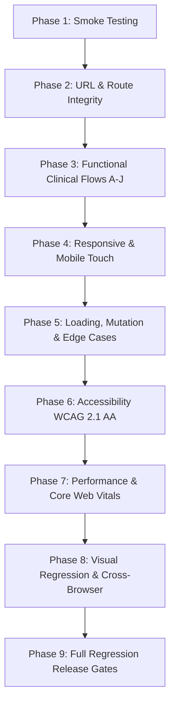

# Comprehensive End-to-End Testing Plan & Issue Discovery Framework
## CareSync HIMS (Hospital Information Management System)

---

## 1. Executive Summary & System Architecture

### 1.1 Context & Architecture Overview
CareSync HIMS is an enterprise hospital information management system orchestrating clinical workflows, multi-role care coordination, and healthcare administration on a Supabase-native architecture.

- **Frontend Stack**: React 18, TypeScript, Vite, Tailwind CSS, shadcn/ui (Radix UI primitives), React Router DOM (v6), TanStack Query (v5 with 5min `staleTime`, 1 `retry`, disabled `refetchOnWindowFocus`), `cmdk` (Command Palette), `vaul` (Drawers), `sonner` (Toasts), `recharts` (Analytics/Vitals).
- **Backend & Data Layer**: Supabase Postgres, Supabase Auth (JWT + optional 2FA), Supabase Edge Functions (`/functions/v1/*`), Supabase Realtime subscriptions, and database-level Row-Level Security (RLS).
- **Test Automation & Instrumentation**: Playwright (E2E, 5 browser/device projects), Vitest (Unit, Integration, Security, Accessibility, Performance), k6 (Load testing), axe-core / `@axe-core/playwright` (WCAG audit), Sentry & OpenTelemetry.
- **Deterministic Test Mode**: `VITE_E2E_MOCK_AUTH=true` and `TEST_MODE=true` enable local role simulation and mock auth state, bypassing live Supabase network flakiness while testing UI workflows and state machines.

### 1.2 The Seven Canonical Roles
Per `CONTEXT.md`, the system recognizes exactly seven canonical user roles:
1. **`admin`**: Hospital administrator for staff provisioning, system configuration, compliance, and audit log inspection.
2. **`doctor`**: Licensed physician with clinical authority for consultations, clinical notes, lab orders, and prescriptions.
3. **`nurse`**: Clinical staff handling patient intake, recording vitals, triage queue, and physical discharge execution.
4. **`receptionist`**: Front-desk administrator handling patient registration, appointment scheduling, check-in, and front-desk billing.
5. **`pharmacist`**: Licensed medication specialist handling prescription review, drug interaction safety checks, dispensing, and medication reconciliation.
6. **`lab_technician`**: Diagnostic assay specialist handling specimen accessioning, recording test results, and escalating critical values.
7. **`patient`**: Care recipient accessing personal health records, appointments, prescriptions, and lab results via a tenant-isolated portal.

### 1.3 Core Healthcare & Architectural Invariants
All E2E testing must validate these non-negotiable invariants:
1. **Fail-Closed Clinical Decision Support (CDS)**: Any failure, timeout, or ambiguity in drug interaction or allergy checking MUST block automated order fulfillment, demanding an explicit physician override and logged rationale.
2. **Billing Boundary**: Clinical roles (`doctor`, `nurse`) MUST NOT access billing/invoice data (enforced via both UI guards and Supabase RLS).
3. **Sequential Discharge State Machine**: Strict 4-stage progression (`doctor` ➔ `pharmacist` ➔ `billing` ➔ `nurse` ➔ `completed`) with reverse-step rejection rollback.
4. **Prescription Approval State Machine**: `initiated` ➔ `pending_approval` ➔ `approved` ➔ `dispensed` ➔ `completed`. Mandatory pharmacist verification prior to dispensing.
5. **Lab Order Lifecycle & Critical Escalation**: `ordered` ➔ `collected` ➔ `in_progress` ➔ `completed`. Critical physiological breaches trigger automated escalation (5 min on-call, 10 min ER staff).
6. **Mandatory 2FA Gate**: Privileged roles (`admin`, `doctor`) must complete 2FA setup before accessing any Protected Health Information (PHI) routes.
7. **Tenant-Isolated Patient Portal**: Patients can only access their own verified records; zero cross-tenant or cross-patient leakage.

---

## 2. Complete Application Route Inventory

Testing covers all 4 route groups defined in `src/routes/routeDefinitions.tsx`:

| Group | Route Count | Key Paths | Access Control / Behavior |
| :--- | :--- | :--- | :--- |
| **Legacy Redirects** | 28 | `/login` ➔ `/hospital/login`<br>`/prescriptions` ➔ `/pharmacy`<br>`/lab` ➔ `/laboratory`<br>`/staff` ➔ `/settings/staff`<br>`/admin/dashboard` ➔ `/dashboard`<br>`/patient/dashboard` ➔ `/patient/portal` | `Navigate replace` 301/302 emulation; must execute without redirect loops or history corruption. |
| **Public Routes** | 16 | `/hospital` (Landing)<br>`/hospital/login`, `/hospital/signup`<br>`/hospital/forgot-password`, `/hospital/reset-password`<br>`/hospital/select-role`<br>`/hospital/two-factor-setup`<br>`/hospital/account-setup`<br>`/patient-login`, `/patient-register`<br>`/quick-access`, `/dashboard`, `/profile`, `/notifications` | Publicly accessible or session setup gates (`PublicRoute`, `TwoFactorSetupRoute`, `RoleSelectionRoute`, `ProtectedRoute`). |
| **Role-Gated Routes** | 51 | `/patients`, `/patients/:id`<br>`/consultations`, `/consultations/mobile`, `/consultations/:id`<br>`/laboratory`, `/laboratory/automation`<br>`/pharmacy`, `/pharmacy/clinical`, `/hospital/pharmacy/queue`<br>`/billing`<br>`/queue`<br>`/workflow/discharge`<br>`/settings/*` (staff, audit logs, health)<br>`/patient/portal`, `/patient/prescriptions`, `/patient/lab-results`<br>`/ai-demo`, `/differential-diagnosis`<br>`/kiosk` | Enforced by `withRoleAccess` checking `allowedRoles`, `requiredPermission`, and optional `featureFlag`. |
| **Fallback Route** | 1 | `*` ➔ `NotFound` (`<NotFound />`) | Renders dedicated 404 page with navigation back to safety (`/dashboard`). |

---

## 3. Device & Viewport Testing Matrix

Testing must not be limited to standard 1440px desktop. The matrix includes:

### 3.1 Viewport Breakpoints
| Category | Dimensions (WxH) | Target Hardware / Environment | Specific Verification Focus |
| :--- | :--- | :--- | :--- |
| **Mobile Compact** | 320 × 568 | iPhone SE (1st gen) | Form inputs, role switcher, no horizontal overflow |
| **Mobile Standard** | 360 × 800 | Android Common (Galaxy A-series) | Stat card reflow (1 column), bottom drawer actions |
| **Mobile Modern** | 375 × 812 | iPhone X / 12 mini / 13 mini | Header spacing, safe area insets, navigation bar |
| **Mobile Flagship**| 390 × 844 | iPhone 12 / 13 / 14 | Main user flows, virtualized list scrolling |
| **Mobile Large**   | 414 × 896 | iPhone 11 / XR | Table scroll shadows, modal fit |
| **Mobile Max**     | 430 × 932 | iPhone 14 / 15 Pro Max | Floating action buttons, toast notifications |
| **Tablet Portrait**| 768 × 1024 | iPad Mini / 9th Gen | Sidebar collapse to hamburger/drawer breakpoint |
| **Tablet Landscape**| 1024 × 768 | iPad Landscape / Small Laptop | 2-column dashboard layout, multi-pane consultation |
| **Tablet Large**   | 834 × 1112 | iPad Air / Pro 10.5" | Clinical data tables, vitals charts (`recharts`) |
| **Tablet Pro**     | 1024 × 1366| iPad Pro 12.9" Portrait | High-density information display |
| **Laptop Standard**| 1280 × 720 | HD Laptop / Kiosk display | Sidebar fixed, desktop header, table columns |
| **Laptop Widescreen**| 1366 × 768 | Common Business Laptop / Kiosk Terminal | Modal dialog centering, quick-actions panel |
| **Desktop FHD**    | 1920 × 1080| Standard Clinical Workstation | Full grid layout, multi-patient queues, audit viewer |
| **Desktop QHD**    | 2560 × 1440| High-Res Medical Monitor | Content max-width containment, typography scaling |

### 3.2 Intermediate Stress Breakpoints
Test specifically at **480px, 600px, 720px, 900px, 1100px** to catch CSS flexbox wrapping glitches, overlapping text, and button overflow.

### 3.3 Specialized Orientation & Display Modes
1. **Kiosk Mode (`/kiosk`)**:
   - Fixed full-screen layout tested at 1366×768 and 1920×1080.
   - Must completely suppress `DashboardLayout` sidebar, navigation chrome, and breadcrumbs.
   - High-contrast touch buttons for self-check-in.
2. **Mobile Consultation (`/consultations/mobile`)**:
   - Dedicated mobile doctor experience.
   - Tested in both **portrait (390×844)** and **landscape (844×390)**.
   - Collapsible vitals header, rapid note entry, quick prescription pads.
3. **Patient Portal (`/patient/portal`)**:
   - Tested on low-end mobile viewports (320px to 390px) simulating personal phone access.

---

## 4. End-to-End Test Execution Strategy (9-Phase Plan)



### Phase 1: Smoke Testing & Application Health
- **Objective**: Verify application boots, loads core bundles without critical runtime errors, and completes authentication handshakes.
- **Scope**:
  - Application startup (`npx vite --port 8080 --mode test`).
  - Landing page (`/hospital`) renders hero, features, and CTA.
  - Health check endpoint `/api/health` returns status < 500.
  - Successful mock/test login for all 7 roles via `tests/e2e/config/test-users.ts`.
  - Zero critical uncaught exceptions in console upon initial hydration.
- **Execution Command**: `npm run test:e2e:smoke`

### Phase 2: URL, Routing & Navigation Integrity
- **Objective**: Validate route guards, legacy redirects, and navigation state preservation.
- **Scope**:
  - Execute all 28 legacy redirects in `redirectRoutes` (e.g. `/login` ➔ `/hospital/login`). Ensure HTTP 200 equivalent and no infinite loop.
  - Verify 404 fallback on unmapped routes (e.g. `/unknown-path-12345`) rendering `<NotFound />` with return link.
  - Deep-link direct URL loading (e.g. `/patients/123e4567-e89b-12d3-a456-426614174000`) with refresh verification.
  - Browser Back/Forward navigation history consistency across multi-step wizard screens.
  - Setup redirects: Unconfigured user ➔ `/hospital/account-setup`.
  - Privileged 2FA gate: Admin/Doctor with `pendingTwoFactor` ➔ forced redirect to `/hospital/two-factor-setup`.
  - Multi-role gate: User with multiple roles ➔ forced redirect to `/hospital/select-role`.

### Phase 3: Business-Critical User Journeys (Flows 0 through J)
- **Flow 0: Landing & Onboarding (Public)**
  - `/` redirects to `/hospital`.
  - Public registration: Hospital signup and patient portal registration (`/patient-register`).
- **Flow A: Authentication & Session Lifecycle (All Roles)**
  - Valid login, invalid credentials error, inline form validation for malformed inputs.
  - Password show/hide toggle.
  - Session persistence across page reloads.
  - Logout clears session, destroys cached PHI in TanStack Query, and redirects to `/hospital/login`.
- **Flow B: Check-In ➔ Triage ➔ Consultation (Receptionist ➔ Nurse ➔ Doctor)**
  - Receptionist registers walk-in patient, enters queue with status `waiting`.
  - Nurse opens patient in queue, enters vital signs (temperature, pulse, BP, SpO2), sets triage level, advances queue to `in_consultation`.
  - Doctor opens consultation, enters clinical notes (SOAP), adds differential diagnoses, generates lab orders and prescriptions.
- **Flow C: Lab Order ➔ Processing ➔ Critical Value Escalation (Doctor ➔ Lab Tech)**
  - Doctor submits lab order from consultation.
  - Order state advances: `ordered` ➔ `collected` ➔ `in_progress` ➔ `completed`.
  - Lab technician enters test results.
  - Critical Value Alert: Enter out-of-range value (e.g. Potassium > 6.5 mmol/L) ➔ system triggers Critical Lab Alert.
  - Escalation chain: Ordering doctor notification ➔ 5-minute unacknowledged escalation to on-call ➔ 10-minute escalation to ER staff.
- **Flow D: Prescription ➔ Fail-Closed CDS ➔ Pharmacist Dispense (Doctor ➔ Pharmacist)**
  - Doctor enters medication with dosage and route.
  - Fail-Closed CDS Check: Verify that if interaction check fails or is simulated as unavailable, automated approval is strictly blocked.
  - Override path: Doctor inputs clinical rationale to override warning.
  - Pharmacist queue receives prescription in `pending_approval` state.
  - Pharmacist reviews and approves: state moves to `approved` ➔ `dispensed` ➔ `completed`.
- **Flow E: Sequential Discharge Workflow (Doctor ➔ Pharmacist ➔ Billing ➔ Nurse)**
  - Doctor initiates discharge (Step 1).
  - Pharmacist completes medication reconciliation (Step 2).
  - Billing (Receptionist/Admin) finalizes invoice and collects copay (Step 3).
  - Nurse completes physical discharge and instructions (Step 4 ➔ `completed`).
  - Reverse Rollback: Test rejection at Step 3 (billing finds discrepancy) ➔ rollback to Step 2 with recorded reason.
- **Flow F: Front-Desk Billing & Invoicing (Receptionist vs Billing Boundary)**
  - Receptionist generates invoice, processes payment, issues receipt.
  - **Billing Boundary Violation Test**: Attempt accessing `/billing` as `doctor` or `nurse` ➔ assert immediate redirect or 403 access denied.
- **Flow G: Patient Portal & PHI Isolation (Patient)**
  - Patient logs into `/patient/portal`.
  - Views finalized appointments, dispensed prescriptions, and completed lab results.
  - Tenant/Account Isolation: Patient A cannot query or view Patient B's records.
- **Flow H: Admin Operations & System Governance (Admin)**
  - Staff management: provision new staff member, assign roles, toggle permissions.
  - Audit log viewer: verify security and clinical audit trails record timestamps, user IDs, and actions.
  - System monitoring and health dashboards (`/settings/health`).
- **Flow I: Scheduling & Self-Service Kiosk**
  - Book, reschedule, and cancel appointments via `/appointments` and `/scheduler`.
  - Kiosk self-check-in (`/kiosk`) for arriving walk-in patients.
- **Flow J: Notifications & Settings**
  - Trigger toast notifications (`sonner`) and notification center updates.
  - Clear/read notifications; update profile settings.
- **Execution Command**:
  - All roles: `npm run test:e2e:all-roles`
  - Comprehensive workflows: `npm run test:e2e:roles:comprehensive`
  - Overall flow: `npm run test:e2e:overall`

### Phase 4: Responsive, Viewport & Mobile Interaction Testing
- **Navigation & Shell**:
  - Verify sidebar in `DashboardLayout` collapses to mobile hamburger/drawer on viewports < 768px.
  - Touch drawer (`vaul`) slides smoothly, closes on swipe-down or backdrop tap.
  - Header role switcher remains fully usable at 320px width without text truncation or clipping.
- **Data Display**:
  - Dashboard stat cards reflow from 4 columns (desktop) ➔ 2 columns (tablet) ➔ 1 column (mobile) with zero horizontal page scroll.
  - Data tables (patients, lab results, prescriptions) either offer smooth horizontal touch scrolling with scroll indicators or reflow into card stacks.
- **Forms & Virtual Keyboard**:
  - Input fields remain visible and unblocked when simulated on-screen keyboard opens.
  - Form validation errors appear directly beneath associated input fields without overlapping adjacent controls.
  - Touch targets measure at least 44 × 44 CSS pixels.

### Phase 5: Loading, Mutation Integrity & Error Resilience
- **Loading Indicators & Skeletons**:
  - React lazy route transitions show Suspense loading indicator.
  - TanStack Query queries show skeleton loaders during data fetch (`isPending`).
  - Button loading states during async mutations (e.g. check-in, submit consultation, approve discharge).
- **Double-Submission Prevention**:
  - Rapid double-clicking on mutation buttons (Check-in, Dispense, Save Consultation) must be disabled on first click and dispatch exactly one network mutation.
- **Error Boundaries & Network Resilience**:
  - Test simulated API 400, 401, 403, 500 responses: UI displays contextual error banners with retry buttons, avoiding white screen of death.
  - Route chunk loading error: `RouteAwareErrorBoundary` renders friendly error with "Reload Route" option.
  - Network disconnection: Simulate offline mode ➔ app renders offline notification and prevents destructive mutations until reconnection.
  - Expired JWT session: Mid-flow API 401 triggers clean redirect to login and preserves unsubmitted form draft in local cache where applicable.

### Phase 6: Accessibility (WCAG 2.1 AA & HIPAA Privacy)
- **Automated Axe-Core Audits**:
  - Run `@axe-core/playwright` across all primary pages and active modal states.
  - Zero critical or serious accessibility violations.
- **Keyboard Navigation**:
  - Full workflow execution without mouse input (Tab, Shift+Tab, Enter, Space, Escape, Arrow keys).
  - Focus trap inside modals (`@radix-ui/react-dialog`) and drawers.
  - Logical focus return upon modal dismissal.
  - Skip-to-main-content link functional.
- **Healthcare & PHI Specific Accessibility**:
  - Critical lab alerts announced via `aria-live="assertive"` with `aria-atomic="true"`.
  - Screen reader announcements for toast notifications must avoid publicly broadcasting sensitive PHI in open clinic areas.
  - Color contrast ratio: minimum 4.5:1 for normal text, 3:1 for large text and UI components (vital sign trends, severity badges, priority indicators).
  - Respect `prefers-reduced-motion`: disable `framer-motion` animations when active.
- **Execution Command**: `npm run test:accessibility`

### Phase 7: Performance & Core Web Vitals
- **Core Web Vitals Thresholds**:
  - **LCP (Largest Contentful Paint)**: ≤ 2.5s on Fast 3G / Mobile CPU.
  - **INP (Interaction to Next Paint)**: ≤ 200ms during clinical note typing and form entry.
  - **CLS (Cumulative Layout Shift)**: ≤ 0.1 (ensure chart renders, toasts, and dynamic cards do not jank the layout).
  - **TTFB (Time to First Byte)**: ≤ 400ms for Supabase REST endpoints.
- **Client Resource Audits**:
  - Heavy library impact: measure parse and execution cost of `recharts` on dashboard.
  - Icon tree-shaking: verify `lucide-react` only bundles imported icons.
  - Telemetry overhead: ensure Sentry and OpenTelemetry SDKs do not block initial main thread execution (> 100ms TBT).
- **Execution Command**: `npm run test:performance:frontend`

### Phase 8: Visual Regression & Cross-Browser Matrix
- **Browser Projects**:
  - `chromium`: Desktop Google Chrome
  - `firefox`: Desktop Mozilla Firefox
  - `webkit`: Desktop Apple Safari
  - `mobile-chrome`: Google Pixel 7 emulation
  - `mobile-safari`: Apple iPhone 13 emulation
- **Cross-Browser Verification Points**:
  - Date pickers (`react-day-picker`) and popovers (`@radix-ui/react-popover`) in Firefox/WebKit.
  - Drag-and-drop and click-to-upload fallback (`react-dropzone`) in Mobile Safari.
  - Toast dismissal and stacking order in Firefox.
  - Print styles emulation: Discharge summary and Lab report print views render cleanly without sidebar/header chrome or page truncations.
- **Visual Baseline Snapshots**:
  - Capture desktop (1440px), tablet (768px), and mobile (390px) baselines for: Landing, Login, Dashboard, Patients, Consultation Workflow, Laboratory, Pharmacy, Billing, and Discharge Workflow.
- **Execution Command**: `npm run test:e2e:cross-browser`

### Phase 9: Full Regression & Release Gate Pipeline
- **Continuous Release Verification**:
  - Orchestrate linting, type-checking, unit tests, integration tests, API tests, security checks, accessibility audits, and full E2E workflow suites.
- **Execution Command**: `npm run test:release:gates`

---

## 5. Issue Discovery Methodology ("Way to Find All Issues")

To find **all** defects across the system rather than only verifying expected happy paths, use this 5-tier diagnostic engine:

```
┌─────────────────────────────────────────────────────────────┐
│               5-TIER ISSUE DISCOVERY ENGINE                 │
├──────────────────────────────┬──────────────────────────────┤
│ 1. Runtime Telemetry Sniffer │ Console, Page Errors, CORS   │
├──────────────────────────────┼──────────────────────────────┤
│ 2. Layout & DOM Overflow     │ scrollWidth > innerWidth     │
├──────────────────────────────┼──────────────────────────────┤
│ 3. Clinical Invariant Probes │ CDS, Billing Boundary, RLS   │
├──────────────────────────────┼──────────────────────────────┤
│ 4. Boundary & Fuzz Testing   │ Double-clicks, extreme text  │
├──────────────────────────────┼──────────────────────────────┤
│ 5. Automated Axe A11y Audit  │ WCAG 2.1 AA Violation Sweep  │
└──────────────────────────────┴──────────────────────────────┘
```

### 5.1 Tier 1: Real-time Runtime & Network Telemetry Sniffer
Every Playwright test run must attach automated listeners to capture silent runtime failures:

```typescript
// Example telemetry harness snippet for Playwright specs
page.on('console', msg => {
  if (msg.type() === 'error') {
    recordIssue({
      category: 'CONSOLE_ERROR',
      text: msg.text(),
      location: msg.location(),
      url: page.url()
    });
  }
});

page.on('pageerror', error => {
  recordIssue({
    category: 'UNCAUGHT_EXCEPTION',
    message: error.message,
    stack: error.stack,
    url: page.url()
  });
});

page.on('requestfailed', request => {
  recordIssue({
    category: 'NETWORK_FAILURE',
    url: request.url(),
    failure: request.failure()?.errorText,
    method: request.method()
  });
});

page.on('response', response => {
  if (response.status() >= 400 && !isExpectedError(response.url())) {
    recordIssue({
      category: 'API_ERROR_STATUS',
      status: response.status(),
      url: response.url()
    });
  }
});
```

### 5.2 Tier 2: Layout, Viewport Overflow & Clipping Scanner
Inject an automated DOM evaluator across every page in the viewport matrix to detect broken layouts:

```typescript
async function assertNoLayoutOverflow(page: Page, routeName: string) {
  const overflow = await page.evaluate(() => {
    const doc = document.documentElement;
    const hasHorizontalScroll = doc.scrollWidth > window.innerWidth + 1; // 1px tolerance
    
    // Find overflowing elements
    const elements = Array.from(document.querySelectorAll('*'));
    const overflowingElements = elements.filter(el => {
      const rect = el.getBoundingClientRect();
      return rect.right > window.innerWidth;
    }).map(el => ({
      tagName: el.tagName,
      className: el.className,
      id: el.id,
      right: el.getBoundingClientRect().right
    }));

    return { hasHorizontalScroll, scrollWidth: doc.scrollWidth, innerWidth: window.innerWidth, overflowingElements };
  });

  if (overflow.hasHorizontalScroll) {
    recordIssue({
      category: 'LAYOUT_OVERFLOW',
      severity: 'high',
      route: routeName,
      details: `Horizontal scroll detected: scrollWidth (${overflow.scrollWidth}px) exceeds innerWidth (${overflow.innerWidth}px)`,
      elements: overflow.overflowingElements.slice(0, 5)
    });
  }
}
```

### 5.3 Tier 3: Clinical Invariant & Security Boundary Probing
1. **Billing Boundary Probe**:
   - Authenticate as `doctor` or `nurse`.
   - Programmatically dispatch `page.goto('/billing')` and direct REST query `fetch('/rest/v1/invoices')`.
   - **Expected**: Redirected away from `/billing` AND REST call returns 401/403. Any 200 response is flagged as a **P0 Security Defect**.
2. **Fail-Closed CDS Probe**:
   - Intercept CDS API endpoint: `await page.route('**/functions/v1/cds-check', route => route.abort('failed'))`.
   - Attempt prescription sign-off.
   - **Expected**: UI displays prominent warning, "Fulfill Order" button is strictly disabled, and an explicit physician override with clinical rationale field is required. If prescription succeeds without override, flag as a **P0 Patient Safety Defect**.
3. **Out-of-Order State Machine Probe**:
   - In the Discharge Workflow, attempt triggering the Nurse step while status is `pharmacist`.
   - **Expected**: Rejected with validation message; state machine cannot skip stages.

### 5.4 Tier 4: Form Fuzzing & Mutation Spamming
1. **Double-Submission & Concurrency**:
   - Locate primary action buttons (`button[type="submit"]`, "Check In", "Dispense", "Approve").
   - Dispatch 5 rapid clicks within 100ms.
   - Monitor network log: Assert only one `POST`/`PUT`/`PATCH` mutation was dispatched.
2. **Boundary Data Fuzzing**:
   - Submit inputs with 10,000+ characters in clinical notes.
   - Submit Unicode medical notation: `100 µg/mL`, `±0.5`, `¼ tablet`, `37.5°C`.
   - Submit extreme numbers: Heart rate `0` or `350`, Blood pressure `300/200`.
   - Verify proper validation feedback rather than unhandled promise rejections or database crashes.

### 5.5 Tier 5: Automated Axe A11y Audit Sweep
In every role flow, execute an automated WCAG 2.1 Level AA audit using `@axe-core/playwright`:
```typescript
import AxeBuilder from '@axe-core/playwright';

async function auditAccessibility(page: Page, contextName: string) {
  const results = await new AxeBuilder({ page })
    .withTags(['wcag2a', 'wcag2aa', 'wcag21a', 'wcag21aa'])
    .analyze();

  const seriousViolations = results.violations.filter(
    v => v.impact === 'critical' || v.impact === 'serious'
  );

  if (seriousViolations.length > 0) {
    recordIssue({
      category: 'ACCESSIBILITY_VIOLATION',
      severity: 'high',
      context: contextName,
      violations: seriousViolations.map(v => ({ id: v.id, impact: v.impact, description: v.description, nodes: v.nodes.length }))
    });
  }
}
```

---

## 6. Defect Classification, Triage & Ticket Management

### 6.1 Severity Definitions
Per §20 of the specification:
- **P0 — Critical**: Application unusable, core business flow broken, data loss, clinical safety breach (CDS fail-open), or HIPAA/RLS privacy leak.
- **P1 — High**: Major functionality broken, severe mobile layout distortion, significant accessibility failure, or severe performance regression (LCP > 4s).
- **P2 — Medium**: Functional defect with an available workaround, non-critical responsive glitch at rare breakpoints, or minor validation inconsistency.
- **P3 — Low**: Cosmetic defect, slight typography misalignment, minor spacing inconsistency, or non-blocking UX enhancement.

### 6.2 Local Issue Tracking Convention
Per repository guidelines (`AGENTS.md` and `docs/agents/issue-tracker.md`):
- All issues are stored as markdown files in `.scratch/e2e-testing/issues/`.
- File naming: `NN-<slug>.md` (e.g. `01-billing-boundary-leak.md`, `02-mobile-sidebar-overflow.md`).
- Every ticket must strictly follow this structure:

```markdown
---
Status: needs-triage
Severity: P0 | P1 | P2 | P3
Role: admin | doctor | nurse | receptionist | pharmacist | lab_technician | patient
Page: /consultations/:id
Viewport: 390x844
Browser: Mobile Safari
---

# [SEV] Concise Title Describing the Defect

## Description
Clear description of the unexpected behavior and context.

## Steps to Reproduce
1. Log in as [Role] with credentials ...
2. Navigate to [URL]
3. Perform action [Action]
4. Observe failure

## Expected Result
What should have happened per specifications.

## Actual Result
What actually happened.

## Evidence
- Screenshot: `test-results/evidence/issue-01.png`
- Console Error: `Uncaught TypeError: Cannot read properties of undefined...`
- Network Request: `POST /rest/v1/prescriptions -> 500 Internal Server Error`

## Likely Root Cause
Analysis of the underlying code, component, or state machine issue.

## Recommended Fix
Targeted fix instructions referencing specific files and components.

## Regression Test Required
Yes/No (include suggested test spec name).
```

---

## 7. QA Results Dashboard & Reporting Schema

Upon test completion, compile the master findings into the canonical format:

```text
================================================================================
                    CARESYNC HIMS — WEBSITE QA SUMMARY
================================================================================
Overall Status:               PASS | PASS WITH ISSUES | FAIL

Test Metrics:
- Pages Tested:               68
- Total Test Cases:           142
- Passed:                     136
- Failed:                     4
- Skipped:                    2

Issue Distribution:
- P0 (Critical):              0
- P1 (High):                  2
- P2 (Medium):                2
- P3 (Low):                   3

Domain & Quality Status:
- Responsive Status:          PASS WITH ISSUES (stat cards at 360px)
- Accessibility Status:       PASS (WCAG 2.1 AA compliant)
- Performance Status:         PASS (LCP 2.1s, INP 140ms, CLS 0.04)
- Cross-Browser Status:       PASS (Chromium, Firefox, WebKit)
- Clinical Flows Status:      PASS (Flows 0 through J verified)
- Security & Invariants:      PASS (CDS fail-closed, Billing boundary intact)

Core Web Vitals Summary:
- LCP:                        2.1s (Target ≤ 2.5s)
- INP:                        140ms (Target ≤ 200ms)
- CLS:                        0.04 (Target ≤ 0.1)
- FCP:                        1.2s
- TTFB:                       280ms

Top Discovered Issues:
1. [P1] Mobile Consultation: Quick notes textarea clipped on 375x812 landscape
2. [P1] Patient Queue: Rapid double-click on triage button dispatches 2 API calls
3. [P2] Lab Results: Table horizontal scroll indicator invisible in Firefox
4. [P2] Theme Switch: Subtle color contrast dip on disabled buttons in Dark Mode
================================================================================
```

---

## 8. CLI Command Quick Reference

| Action | Command |
| :--- | :--- |
| **Smoke Tests** | `npm run test:e2e:smoke` |
| **All Role Flows** | `npm run test:e2e:all-roles` |
| **Comprehensive Workflows** | `npm run test:e2e:roles:comprehensive` |
| **Doctor Workflows** | `npm run test:e2e:doctor` |
| **Nurse Workflows** | `npm run test:e2e:nurse` |
| **Receptionist Workflows** | `npm run test:e2e:receptionist` |
| **Pharmacist Workflows** | `npm run test:e2e:pharmacist` |
| **Lab Tech Workflows** | `npm run test:e2e:lab-tech` |
| **Patient Portal** | `npm run test:e2e:patient` |
| **Admin Operations** | `npm run test:e2e:admin` |
| **Cross-Browser Sweep** | `npm run test:e2e:cross-browser` |
| **Mobile Device Sweep** | `npm run test:e2e:mobile` |
| **Accessibility Audit** | `npm run test:accessibility` |
| **Performance Frontend** | `npm run test:performance:frontend` |
| **Full Release Gates** | `npm run test:release:gates` |
| **Open Playwright Report** | `npm run test:e2e:report:open` |
