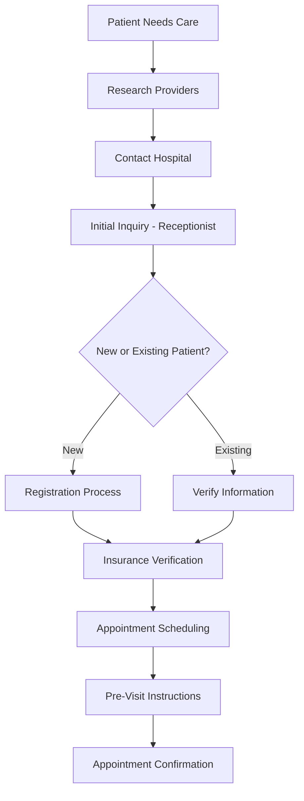
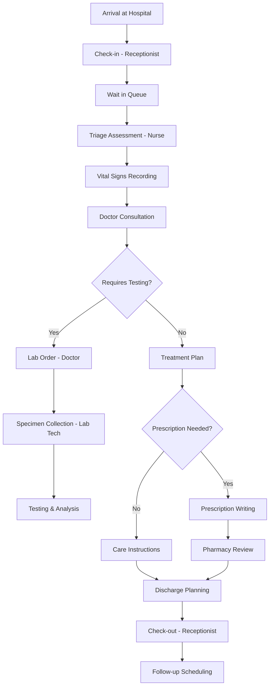
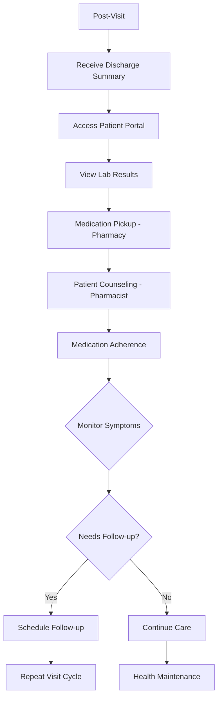
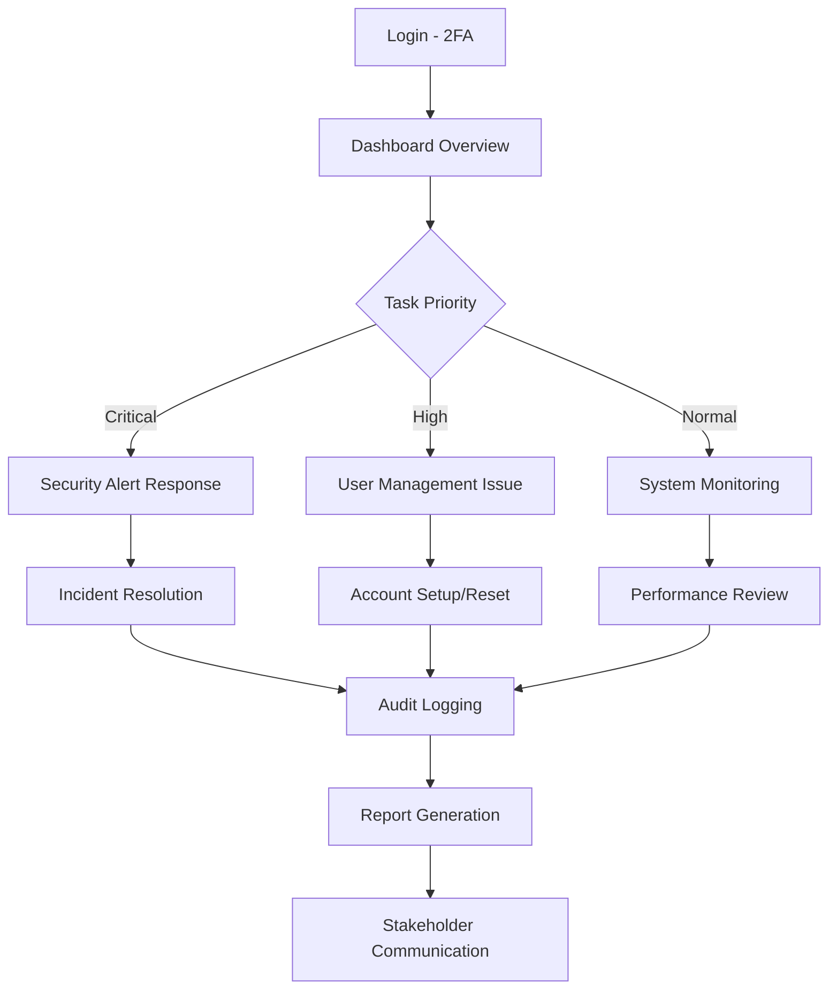
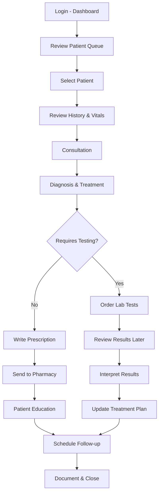
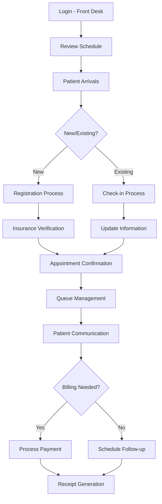
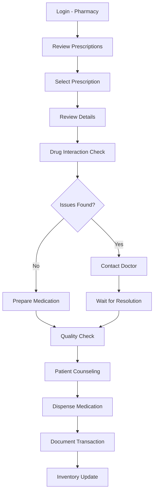
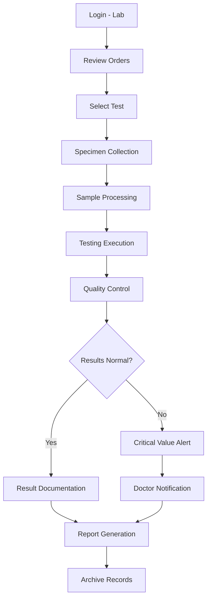
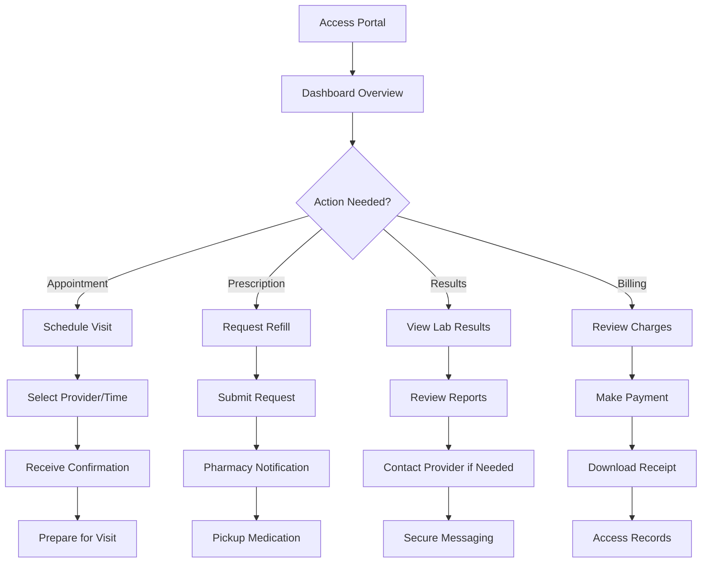
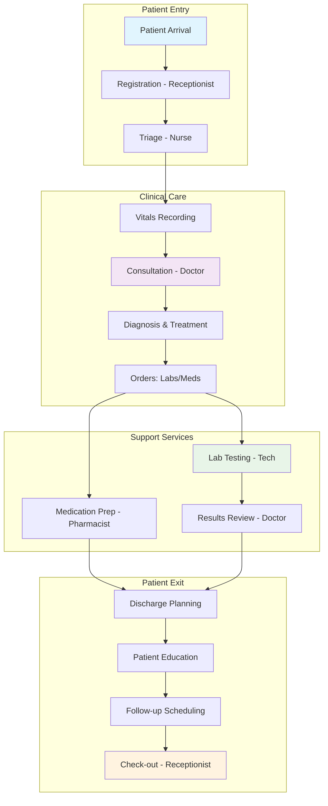

# CareSync Comprehensive Workflow Document

## Executive Summary

This document provides a holistic view of the CareSync Hospital Management System (HMS), detailing all user roles, workflows, interdependencies, and system integration points. CareSync is a cloud-native SaaS platform designed to digitize healthcare operations for small and medium-sized hospitals, featuring AI-powered diagnostics, real-time collaboration, and comprehensive compliance features.

---

## Table of Contents

1. [Role Definitions and Responsibilities](#1-role-definitions-and-responsibilities)
2. [Patient Journey Mapping](#2-patient-journey-mapping)
3. [User Journeys for Each Role](#3-user-journeys-for-each-role)
4. [Interdependencies and Cross-Role Workflows](#4-interdependencies-and-cross-role-workflows)
5. [Overall System Workflow](#5-overall-system-workflow)
6. [Gap Analysis and Recommendations](#6-gap-analysis-and-recommendations)
7. [Technical Implementation Details](#7-technical-implementation-details)
8. [Compliance and Security](#8-compliance-and-security)

---

## 1. Role Definitions and Responsibilities

### 1.1 Administrative Roles

#### System Administrator
**Primary Duties:**
- User account management and role assignment
- System configuration and feature toggles
- Security policy management and audit monitoring
- Performance analytics and reporting
- Backup and disaster recovery coordination

**Access Level:** Full system access with hospital-scoped data isolation
**Key Interactions:** All roles (management/supervisory), external systems (monitoring tools)

#### Department Head
**Primary Duties:**
- Department-specific user management
- Performance monitoring and quality metrics
- Resource allocation and scheduling oversight
- Compliance reporting for their department

**Access Level:** Department-scoped administrative access
**Key Interactions:** Department staff, System Administrator

### 1.2 Clinical Roles

#### Doctor
**Primary Duties:**
- Patient consultations and diagnosis
- Treatment planning and prescription writing
- Lab test ordering and result interpretation
- Care coordination and handoffs
- Discharge planning and follow-up scheduling

**Access Level:** Read/write access to patient records, prescriptions, lab orders
**Key Interactions:** Nurses, Pharmacists, Lab Technicians, Patients

#### Nurse
**Primary Duties:**
- Patient assessment and vital signs monitoring
- Medication administration and documentation
- Care plan execution and updates
- Patient education and discharge preparation
- Coordination with clinical team

**Access Level:** Read/write access to patient vitals, medications, care plans
**Key Interactions:** Doctors, Pharmacists, Receptionists, Patients

#### Pharmacist
**Primary Duties:**
- Prescription review and drug interaction checking
- Medication dispensing and counseling
- Inventory management and stock monitoring
- Clinical decision support for medication safety

**Access Level:** Read/write access to prescriptions, inventory, drug databases
**Key Interactions:** Doctors, Nurses, Patients

#### Lab Technician
**Primary Duties:**
- Specimen collection and processing
- Laboratory testing and analysis
- Quality control and equipment maintenance
- Result reporting and critical value alerts

**Access Level:** Read/write access to lab orders, test results, equipment logs
**Key Interactions:** Doctors, Nurses, Quality Control systems

### 1.3 Support Roles

#### Receptionist
**Primary Duties:**
- Patient registration and check-in/check-out
- Appointment scheduling and management
- Insurance verification and billing coordination
- Front desk operations and patient communication

**Access Level:** Read/write access to appointments, patient demographics, billing
**Key Interactions:** All clinical roles, Patients, Insurance systems

### 1.4 Patient Role

#### Patient
**Primary Duties:**
- Self-service appointment scheduling
- Access to personal health records
- Prescription refill requests
- Secure messaging with healthcare providers
- Billing and payment management

**Access Level:** Read-only access to own records, limited write access for requests
**Key Interactions:** All healthcare roles, Self-service portals

### 1.5 Role Assignment and Approval Flow
**Purpose:** Ensure roles are granted through an approval step rather than automatic self-assignment.

**Process:**
- During Account Setup, users submit a role selection request (no direct `user_roles` insert from the client).
- Approver: System Administrator or Department Head for the user’s hospital.
- Prerequisite: User must have a profile linked to a hospital (`profiles.hospital_id`).
- Outcome: Approved role is inserted into `user_roles`; declined requests are logged with reason.
- SLA guidance: Target approval within 1 business day; escalate to System Administrator if delayed.

### 1.6 Department Head Workflow (Summary)
**Responsibilities:** Department user management, schedule/roster oversight, quality and performance metrics, policy enforcement, and approval of role requests within the department.

**Daily Flow:**
- Start-of-day: review department dashboard (staff availability, queue load, critical alerts).
- Approvals: process role requests for department staff and adjust schedules.
- Operations: monitor SLAs (wait times, turnaround for labs/pharmacy) and reassign tasks as needed.
- Quality: review incident/variance reports, initiate corrective actions.
- Handoffs: end-of-day summary to System Administrator with blockers and staffing risks.

**Full Workflow:** See [docs/workflows/DEPARTMENT-HEAD-WORKFLOW.md](docs/workflows/DEPARTMENT-HEAD-WORKFLOW.md) for detailed steps, technical notes, and pending enhancements.

---

## 2. Patient Journey Mapping

### 2.1 Pre-Visit Phase



### 2.2 Visit Day Journey



### 2.3 Post-Visit Phase



### 2.4 Decision Points and Pain Points

| Decision Point | Options | Potential Pain Points |
|----------------|---------|----------------------|
| Provider Selection | Online research, referrals, walk-in | Limited online information, long wait times |
| Appointment Scheduling | Online portal, phone, walk-in | System unavailability, limited slots |
| Check-in Process | Digital kiosk, front desk | Long queues, paperwork errors |
| Triage Assessment | ESI scoring system | Inconsistent prioritization |
| Test Ordering | Standard panels, custom tests | Unnecessary testing, delays |
| Prescription Process | E-prescribing, manual | Drug interactions missed, pickup delays |
| Discharge Process | Digital summary, verbal | Incomplete instructions, follow-up gaps |

### 2.5 Patient Portal vs In-Clinic Flows
**Portal:** scheduling, refill requests, bill pay, secure messaging, result viewing; access limited to the patient’s own records. Notifications: appointment confirmations/changes, lab results ready, prescription ready, billing due.

**In-Clinic:** reception check-in, triage, consultation, discharge, payment. Notifications: in-clinic queue position, room readiness, post-visit follow-up reminders.

**Access Boundaries:** All patient-facing notifications and data are scoped to the patient’s own records; cross-patient visibility is blocked by RLS and client-side guards.

---

## 3. User Journeys for Each Role

### 3.1 Administrator Journey



**Detailed Steps:**
1. **System Access**: Secure login with role-based dashboard
2. **Alert Monitoring**: Real-time system health and security alerts
3. **User Management**: Create/edit/deactivate accounts, assign roles
4. **Configuration**: Update hospital settings, feature toggles
5. **Analytics Review**: Performance metrics, compliance reports
6. **Maintenance**: Backup scheduling, system updates
7. **Audit Review**: Security logs, user activity monitoring

### 3.2 Doctor Journey



**Detailed Steps:**
1. **Morning Prep**: Review schedule, critical alerts, pending tasks
2. **Patient Selection**: Queue management, priority assessment
3. **Pre-Consultation**: Review history, vitals, previous notes
4. **Consultation**: SOAP documentation, AI diagnostic support
5. **Decision Making**: Diagnosis, treatment planning
6. **Ordering**: Labs, imaging, medications with safety checks
7. **Collaboration**: Messaging with care team, handoffs
8. **Documentation**: Complete notes, generate summaries
9. **Follow-up**: Schedule appointments, patient instructions

### 3.3 Nurse Journey

```mermaid
graph TD
    A[Login - Shift Start] --> B[Review Assignments]
    B --> C[Patient Rounds]
    C --> D[Assess Patient Status]
    D --> E[Record Vital Signs]
    E --> F{Critical Values?}

        F -->|Yes| G[Alert Doctor]
        F -->|No| H[Update Care Plan]
    
        **Readiness Notes:** Wearable vitals integration, predictive deterioration scoring, and the advanced education platform are pending; current flow relies on manual vitals entry and standard education materials. Medication reminders and alerts depend on provider orders and existing notification rules.
    G --> I[Monitor Response]
    H --> J{Medication Due?}
    J -->|Yes| K[Administer Medication]
    J -->|No| L[Patient Care Tasks]
    K --> M[Document Administration]
    L --> N[Patient Education]
    M --> O[End of Shift]
    N --> O
    I --> O
```

**Detailed Steps:**
1. **Shift Preparation**: Review patient assignments, care plans
2. **Patient Assessment**: Initial evaluation, vital signs
3. **Monitoring**: Continuous observation, trend analysis
4. **Medication Management**: Administration, documentation
5. **Care Coordination**: Communication with doctors, updates
6. **Patient Support**: Education, comfort measures
7. **Handoff**: End-of-shift reports, care transitions

### 3.4 Receptionist Journey



**Detailed Steps:**
1. **Daily Setup**: Review appointments, prepare workstation
2. **Patient Registration**: New patient intake, documentation
3. **Check-in Management**: Arrival processing, queue coordination
4. **Scheduling**: Book, modify, cancel appointments
5. **Communication**: Patient updates, provider notifications
6. **Billing Support**: Co-pay collection, insurance coordination
7. **End-of-Day**: Queue closure, reporting

### 3.5 Pharmacist Journey



**Detailed Steps:**
1. **Prescription Review**: Incoming orders, verification
2. **Safety Checks**: Interactions, allergies, contraindications
3. **Preparation**: Compounding, labeling, packaging
4. **Quality Control**: Final verification, expiration checks
5. **Patient Interaction**: Counseling, instructions
6. **Dispensing**: Handover, documentation
7. **Inventory Management**: Stock monitoring, ordering

### 3.6 Lab Technician Journey



**Detailed Steps:**
1. **Order Processing**: Review and prioritize lab orders
2. **Specimen Handling**: Collection, labeling, transport
3. **Processing**: Centrifugation, aliquoting, preparation
4. **Testing**: Instrument operation, calibration
5. **Analysis**: Result interpretation, validation
6. **Reporting**: Critical value alerts, result delivery
7. **Quality Assurance**: Control checks, documentation

### 3.7 Patient Journey



**Detailed Steps:**
1. **Portal Access**: Secure login, dashboard overview
2. **Appointment Management**: Scheduling, modifications, cancellations
3. **Health Record Access**: View history, results, medications
4. **Prescription Management**: Refills, pickup tracking
5. **Communication**: Secure messaging with providers
6. **Billing Interaction**: View charges, make payments
7. **Education**: Access health information, instructions

---

## 4. Interdependencies and Cross-Role Workflows

### 4.1 Data Flow Dependencies

| Source Role | Target Role | Data Type | Trigger | Frequency |
|-------------|-------------|-----------|---------|-----------|
| Receptionist | Nurse | Patient demographics, insurance | Check-in completion | Per patient visit |
| Nurse | Doctor | Vital signs, assessment notes | Triage completion | Per consultation |
| Doctor | Pharmacist | Prescriptions, clinical notes | Treatment planning | Per prescription |
| Doctor | Lab Tech | Test orders, clinical indication | Diagnostic needs | Per test panel |
| Lab Tech | Doctor | Test results, interpretations | Test completion | Per result |
| Pharmacist | Nurse | Dispensing confirmation, instructions | Medication ready | Per prescription |
| All Clinical | Patient | Health records, instructions | Care delivery | Per interaction |

### 4.2 Communication Workflows

#### Real-Time Notifications
- **Doctor → Nurse**: Critical vital signs, care plan updates
- **Doctor → Pharmacist**: Urgent prescription clarifications
- **Lab Tech → Doctor**: Critical value alerts (immediate)
- **Pharmacist → Doctor**: Drug interaction concerns
- **Nurse → Doctor**: Patient status changes
- **Receptionist → All**: Appointment changes, patient arrivals

#### Automated Workflows
- **Appointment Confirmation**: Receptionist → Patient (email/SMS)
- **Lab Result Available**: System → Doctor/Patient (notification)
- **Prescription Ready**: Pharmacy → Patient (notification)
- **Follow-up Reminders**: System → Patient (scheduled)
- **Medication Due**: System → Nurse (alert)

### 4.3 Handoff Processes

#### Patient Admission Handoff
```
Receptionist → Nurse → Doctor
├── Demographics & insurance
├── Chief complaint & history
├── Vital signs & assessment
└── Care plan initiation
```

#### Inter-Shift Handoff
```
Outgoing Nurse → Incoming Nurse
├── Patient status summary
├── Pending medications
├── Care plan progress
└── Outstanding tasks
```

#### Discharge Handoff
```
Doctor → Nurse → Pharmacist → Patient
├── Discharge instructions
├── Medication reconciliation
├── Follow-up appointments
└── Home care plan
```

### 4.4 Automated Integration Points

#### AI-Powered Features
- **Diagnostic Support**: Doctor consultation enhancement
- **Drug Interaction Checking**: Prescription safety validation
- **Triage Scoring**: Patient priority assessment
- **Appointment Optimization**: Scheduling intelligence

#### System Integrations
- **Insurance Verification**: Real-time eligibility checking
- **Payment Processing**: Secure transaction handling
- **Lab Equipment**: Direct result importing
- **Pharmacy Networks**: External prescription routing

### 4.5 Hospital Scoping and RLS Notes
- All role access is hospital-scoped via RLS; cross-hospital data is blocked by policy and UI guards.
- Notifications, queues, and workflow rules are filtered by `hospital_id`; role checks are enforced on actions that mutate clinical data.
- Department Head approvals apply only within their department/hospital; System Administrators can override across hospitals.

---

## 5. Overall System Workflow

### 5.1 Core Process Flow



### 5.2 Parallel Workflows

#### Administrative Oversight
```
System Monitoring → Performance Analytics → Quality Improvement
                      ↓
User Management → Access Control → Security Auditing
                      ↓
Configuration → Feature Deployment → Training Updates
```

#### Quality Assurance
```
Clinical Documentation → Peer Review → Quality Metrics
                        ↓
Patient Feedback → Satisfaction Surveys → Process Improvement
                        ↓
Audit Trails → Compliance Reports → Regulatory Updates
```

### 5.3 Exception Handling

#### Critical Events
- **Code Blue**: Immediate alerts to all clinical staff
- **Critical Lab Values**: Automatic doctor notification
- **Adverse Drug Reaction**: Pharmacy alert system
- **Patient Elopement**: Security and clinical response

#### System Failures
- **Network Outage**: Offline mode activation
- **Database Issues**: Read-only mode, backup procedures
- **Security Breach**: Incident response protocol

---

## 6. Gap Analysis and Recommendations

### 6.1 Current System Gaps

#### Workflow Inefficiencies
1. **Manual Data Entry**: Multiple points of redundant data input
2. **Communication Delays**: Lack of real-time cross-role messaging
3. **Task Assignment**: Manual workflow routing vs. automated
4. **Documentation Burden**: Excessive paperwork requirements

#### Security Vulnerabilities
1. **Session Management**: 30-minute timeout not consistently enforced
2. **Data Encryption**: In-transit encryption gaps in some integrations
3. **Access Controls**: Over-privileged accounts in some roles
4. **Audit Gaps**: Incomplete logging of sensitive operations

#### Scalability Issues
1. **Performance Degradation**: Under high concurrent user loads
2. **Database Bottlenecks**: Inefficient queries for large datasets
3. **Integration Limitations**: Point-to-point vs. standardized APIs
4. **Mobile Responsiveness**: Limited offline capabilities

#### User Experience Flaws
1. **Learning Curve**: Complex interfaces for non-technical users
2. **Mobile Access**: Limited functionality on mobile devices
3. **Notification Overload**: Too many alerts reducing effectiveness
4. **Error Recovery**: Poor error handling and user guidance

### 6.2 Actionable Recommendations

#### Immediate Actions (0-3 months)
1. **Implement Real-time Messaging**: Deploy cross-role communication system
2. **Automate Task Assignment**: AI-powered workflow routing
3. **Enhance Mobile Experience**: PWA improvements and offline support
4. **Strengthen Session Security**: Consistent timeout enforcement

#### Short-term Improvements (3-6 months)
1. **Workflow Automation**: Implement smart defaults and templates
2. **Performance Optimization**: Database query optimization and caching
3. **User Training Program**: Comprehensive onboarding and support
4. **Integration Standardization**: Move to FHIR-based APIs

#### Long-term Enhancements (6-12 months)
1. **AI Integration**: Advanced diagnostic and predictive analytics
2. **IoT Integration**: Wearable device and equipment connectivity
3. **Advanced Analytics**: Population health and predictive modeling
4. **Blockchain Security**: Immutable audit trails for compliance

#### Compliance and Security
1. **Zero-trust Architecture**: Implement comprehensive access controls
2. **End-to-end Encryption**: All data transmission and storage
3. **Automated Compliance**: Continuous monitoring and reporting
4. **Incident Response**: 24/7 security operations center

### 6.3 Implementation Roadmap

```mermaid
gantt
    title CareSync Enhancement Roadmap
    dateFormat YYYY-MM-DD
    section Phase 1 (Q1 2026)
    Real-time messaging      :active, 2026-01-01, 45d
    Mobile PWA improvements  :active, 2026-01-15, 60d
    Session security         :active, 2026-02-01, 30d
    Task automation          :active, 2026-02-15, 60d

    section Phase 2 (Q2 2026)
    Workflow optimization    :2026-03-01, 90d
    Performance tuning       :2026-04-01, 60d
    User training program    :2026-04-15, 45d
    API standardization      :2026-05-01, 75d

    section Phase 3 (Q3-Q4 2026)
    AI diagnostics           :2026-06-01, 120d
    IoT integration          :2026-08-01, 90d
    Advanced analytics       :2026-09-01, 90d
    Blockchain security      :2026-10-01, 75d

### 6.4 Current Delivery Status (alignment)
- Real-time messaging: partially delivered (core notifications live; cross-role chat still in progress) — adjust roadmap to “in progress”.
- Task automation: orchestration layer live for event logging and rule-driven tasks; broader auto-routing and retries pending.
- AI triage/diagnostics: basic suggestions live; advanced models and nurse-facing early warning pending.
- Mobile/PWA: improvements partially shipped; offline workflows not complete.
```

---

## 7. Technical Implementation Details

### 7.1 System Architecture

#### Frontend Layer
- **Framework**: React 18 with TypeScript
- **State Management**: TanStack Query + React Context
- **UI Components**: Shadcn/ui + Tailwind CSS
- **Routing**: React Router with lazy loading
- **PWA Features**: Service workers, offline support

#### Backend Layer
- **Platform**: Supabase (PostgreSQL + Edge Functions)
- **Authentication**: Supabase Auth with 2FA
- **Real-time**: Supabase Realtime for live updates
- **Storage**: Supabase Storage for documents/images
- **Edge Functions**: 15+ serverless functions for business logic

#### Security Layer
- **Row Level Security**: Hospital-scoped data isolation
- **Role-Based Access**: 7 distinct role permissions
- **Encryption**: AES-256 for data at rest
- **Audit Logging**: Comprehensive activity tracking

### 7.2 Database Schema

#### Core Tables (46+ tables)
- **Users & Auth**: profiles, user_roles, sessions
- **Clinical**: patients, consultations, prescriptions, lab_orders
- **Operations**: appointments, vital_signs, medications
- **Admin**: audit_logs, system_settings, notifications
- **Integration**: care_gaps, task_assignments, workflows

#### Key Relationships
- Hospital-scoped isolation via foreign keys
- Role-based access through RLS policies
- Audit trails on all critical operations
- Real-time subscriptions for live updates

### 7.3 API Architecture

#### RESTful Endpoints
- CRUD operations for all entities
- Role-based filtering and validation
- Pagination for large datasets
- Error handling with detailed messages

#### Real-time Subscriptions
- Live patient queue updates
- Real-time notifications
- Collaborative document editing
- System status monitoring

### 7.4 Integration Points

#### External Systems
- **Insurance**: Real-time verification APIs
- **Labs**: HL7/FHIR result importing
- **Pharmacy**: E-prescribing networks
- **Payment**: PCI-compliant processors

#### Internal Workflows
- **Task Automation**: AI-powered assignment
- **Quality Monitoring**: Automated compliance checks
- **Performance Tracking**: Real-time metrics collection
- **Backup Systems**: Automated disaster recovery

### 7.5 Workflow Automation Layer
- **Tables:** `workflow_events` (captured triggers with payload, priority, source role/user), `workflow_rules` (active rules per hospital with actions), `workflow_tasks` (resulting tasks with assignment and status).
- **Action Types:** create_task (assigned_role/user, priority), send_notification, update_status, trigger_function (invoke Supabase functions), escalate.
- **Triggers:** event types emitted by UI/services (e.g., new prescription, abnormal vitals, lab result posted) routed through the orchestrator.
- **Error Handling:** actions log failures; retries are manual today. Add alerts for failed actions to admins in future work.

### 7.6 Performance & Resilience
- Orchestration actions do not auto-retry; monitor failed actions and surface admin alerts (planned).
- Prefer existing TanStack Query hooks to leverage caching and reduce duplicate Supabase calls.
- Offline/PWA support is partial; critical workflows require connectivity.

---

## 8. Compliance and Security

### 8.1 Regulatory Compliance

#### HIPAA Compliance
- **Privacy Rule**: Protected health information safeguards
- **Security Rule**: Administrative, physical, technical safeguards
- **Breach Notification**: 60-day reporting requirement
- **Business Associates**: BA agreement management

#### NABH Standards
- **Patient Safety**: Error prevention and reporting
- **Clinical Care**: Evidence-based practice guidelines
- **Medication Safety**: Five rights of medication administration
- **Infection Control**: Standard precautions and protocols

### 8.2 Security Measures

#### Access Control
- **Multi-factor Authentication**: Required for all users
- **Role-Based Permissions**: Least privilege principle
- **Session Management**: Automatic timeout and monitoring
- **Biometric Options**: Future enhancement for high-security areas

#### Data Protection
- **Encryption**: End-to-end encryption for all data
- **Data Masking**: Sensitive data protection in logs
- **Backup Security**: Encrypted offsite backups
- **Disaster Recovery**: 4-hour RTO, 24-hour RPO

#### Monitoring and Auditing
- **Real-time Monitoring**: System health and security alerts
- **Comprehensive Logging**: All user actions tracked
- **Regular Audits**: Automated and manual compliance reviews
- **Incident Response**: 24/7 security team availability

### 8.3 Risk Management

#### Threat Assessment
- **External Threats**: DDoS, malware, unauthorized access
- **Internal Threats**: Insider threats, accidental exposure
- **Data Breach**: PHI exposure scenarios
- **System Failure**: Downtime and data loss

#### Mitigation Strategies
- **Defense in Depth**: Multiple security layers
- **Regular Testing**: Penetration testing and vulnerability scans
- **Employee Training**: Security awareness programs
- **Insurance Coverage**: Cyber liability and breach response

---

## Conclusion

This comprehensive workflow document provides stakeholders with a complete understanding of the CareSync system, from individual role responsibilities to system-wide interdependencies. The documented gaps and recommendations serve as a roadmap for continuous improvement, ensuring CareSync remains a leading solution for digital healthcare transformation.

**Key Success Factors:**
- Seamless cross-role collaboration
- Robust security and compliance
- Scalable and maintainable architecture
- User-centric design and experience
- Continuous innovation and improvement

**Next Steps:**
1. Review and validate workflows with end users
2. Prioritize gap remediation based on impact
3. Implement phased enhancement roadmap
4. Establish continuous monitoring and feedback loops

---

*Document Version: 1.0*
*Last Updated: January 28, 2026*
*Next Review: April 2026*