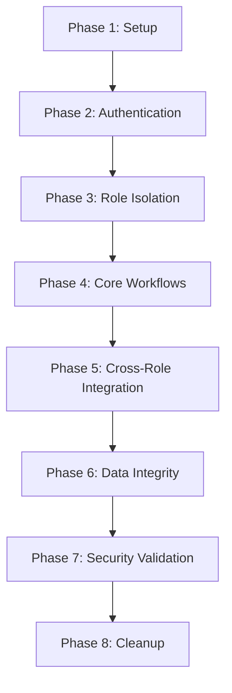

# CareSync HMS - End-to-End Testing Workflow

**Version:** 1.0  
**Last Updated:** February 2026  
**Purpose:** Comprehensive automated testing strategy for all user roles, permissions, and critical workflows

---

## Table of Contents

1. [Testing Architecture](#testing-architecture)
2. [Test Execution Flow](#test-execution-flow)
3. [Role-Based Test Scenarios](#role-based-test-scenarios)
4. [Cross-Role Integration Tests](#cross-role-integration-tests)
5. [Data Integrity Tests](#data-integrity-tests)
6. [Security & Permission Tests](#security--permission-tests)
7. [Test Automation Scripts](#test-automation-scripts)

---

## Testing Architecture

### Test Stack
- **Framework:** Playwright (E2E), Vitest (Unit/Integration)
- **API Testing:** Supertest + Supabase Client
- **Database:** Isolated test database with seed data
- **CI/CD:** GitHub Actions with parallel execution
- **Reporting:** Allure Reports + Custom Dashboard

### Test Environment Setup
```typescript
// tests/setup/test-environment.ts
export const TEST_USERS = {
  admin: { email: 'admin@test.hospital', password: 'Test123!@#', role: 'admin' },
  doctor: { email: 'doctor@test.hospital', password: 'Test123!@#', role: 'doctor' },
  nurse: { email: 'nurse@test.hospital', password: 'Test123!@#', role: 'nurse' },
  receptionist: { email: 'reception@test.hospital', password: 'Test123!@#', role: 'receptionist' },
  pharmacist: { email: 'pharma@test.hospital', password: 'Test123!@#', role: 'pharmacist' },
  lab_tech: { email: 'lab@test.hospital', password: 'Test123!@#', role: 'lab_tech' },
  patient: { email: 'patient@test.hospital', password: 'Test123!@#', role: 'patient' }
};

export const TEST_HOSPITAL = {
  id: 'test-hospital-001',
  name: 'Test General Hospital',
  type: 'multi_specialty'
};
```

---

## Test Execution Flow

### Sequential Test Phases



### Execution Order
1. **Setup (5 min)** - Database seed, user creation, hospital setup
2. **Authentication (10 min)** - Login flows, session management, 2FA
3. **Role Isolation (15 min)** - Permission boundaries, RLS validation
4. **Core Workflows (45 min)** - Individual role operations
5. **Cross-Role Integration (60 min)** - Multi-role patient journeys
6. **Data Integrity (20 min)** - Consistency checks, audit logs
7. **Security Validation (30 min)** - Penetration tests, HIPAA compliance
8. **Cleanup (5 min)** - Test data removal, state reset

**Total Execution Time:** ~3 hours (parallelizable to 45 minutes)

---

## Role-Based Test Scenarios

### 1. ADMIN Role Tests

#### Test Suite: `tests/e2e/tests/roles/admin/admin.spec.ts`

**Scenario A1: User Management**
```typescript
test('A1.1: Create new staff member with role assignment', async ({ page }) => {
  await loginAs(page, 'admin');
  await page.goto('/admin/users');
  
  // Create doctor
  await page.click('[data-testid="add-user-btn"]');
  await page.fill('[name="email"]', 'newdoctor@test.hospital');
  await page.fill('[name="first_name"]', 'John');
  await page.fill('[name="last_name"]', 'Doe');
  await page.selectOption('[name="role"]', 'doctor');
  await page.click('[data-testid="submit-user"]');
  
  // Verify user created
  await expect(page.locator('text=User created successfully')).toBeVisible();
  
  // Verify RLS: User belongs to correct hospital
  const userId = await page.getAttribute('[data-testid="new-user-id"]', 'data-id');
  const dbCheck = await supabase
    .from('profiles')
    .select('hospital_id, role')
    .eq('id', userId)
    .single();
  
  expect(dbCheck.data.hospital_id).toBe(TEST_HOSPITAL.id);
  expect(dbCheck.data.role).toBe('doctor');
});

test('A1.2: Cannot create user for different hospital', async ({ page }) => {
  await loginAs(page, 'admin');
  
  // Attempt to manipulate hospital_id via API
  const response = await page.request.post('/api/users', {
    data: {
      email: 'hacker@other.hospital',
      hospital_id: 'other-hospital-id',
      role: 'admin'
    }
  });
  
  expect(response.status()).toBe(403);
});
```

**Scenario A2: System Configuration**
```typescript
test('A2.1: Update hospital settings', async ({ page }) => {
  await loginAs(page, 'admin');
  await page.goto('/admin/settings');
  
  await page.fill('[name="opd_start_time"]', '08:00');
  await page.fill('[name="opd_end_time"]', '20:00');
  await page.check('[name="enable_online_booking"]');
  await page.click('[data-testid="save-settings"]');
  
  // Verify settings persisted
  await page.reload();
  await expect(page.locator('[name="opd_start_time"]')).toHaveValue('08:00');
});
```

**Scenario A3: Analytics Access**
```typescript
test('A3.1: View hospital-wide analytics', async ({ page }) => {
  await loginAs(page, 'admin');
  await page.goto('/admin/analytics');
  
  // Verify dashboard loads
  await expect(page.locator('[data-testid="total-patients"]')).toBeVisible();
  await expect(page.locator('[data-testid="revenue-chart"]')).toBeVisible();
  
  // Verify data isolation
  const patientCount = await page.textContent('[data-testid="total-patients"]');
  const dbCount = await supabase
    .from('patients')
    .select('count', { count: 'exact' })
    .eq('hospital_id', TEST_HOSPITAL.id);
  
  expect(parseInt(patientCount)).toBe(dbCount.count);
});
```

---

### 2. RECEPTIONIST Role Tests

#### Test Suite: `tests/e2e/tests/roles/receptionist/receptionist.spec.ts`

**Scenario R1: Patient Registration**
```typescript
test('R1.1: Register new patient with complete details', async ({ page }) => {
  await loginAs(page, 'receptionist');
  await page.goto('/reception/register');
  
  const patientData = {
    first_name: 'Jane',
    last_name: 'Smith',
    date_of_birth: '1990-05-15',
    gender: 'female',
    phone: '+1234567890',
    email: 'jane.smith@email.com',
    blood_group: 'O+',
    address: '123 Main St'
  };
  
  // Fill registration form
  for (const [key, value] of Object.entries(patientData)) {
    await page.fill(`[name="${key}"]`, value);
  }
  
  await page.click('[data-testid="register-patient"]');
  
  // Verify patient created
  const patientId = await page.getAttribute('[data-testid="patient-id"]', 'data-id');
  expect(patientId).toBeTruthy();
  
  // Verify MRN generated
  const mrn = await page.textContent('[data-testid="patient-mrn"]');
  expect(mrn).toMatch(/^MRN-\d{8}$/);
  
  // Verify audit log
  const auditLog = await supabase
    .from('activity_logs')
    .select('*')
    .eq('entity_type', 'patient')
    .eq('entity_id', patientId)
    .eq('action', 'created')
    .single();
  
  expect(auditLog.data).toBeTruthy();
});
```

**Scenario R2: Appointment Scheduling**
```typescript
test('R2.1: Schedule appointment with available doctor', async ({ page }) => {
  await loginAs(page, 'receptionist');
  
  // Create patient first
  const patient = await createTestPatient();
  
  await page.goto('/reception/appointments');
  await page.click('[data-testid="new-appointment"]');
  
  // Search and select patient
  await page.fill('[data-testid="patient-search"]', patient.mrn);
  await page.click(`[data-testid="patient-${patient.id}"]`);
  
  // Select doctor and time
  await page.selectOption('[name="doctor_id"]', TEST_USERS.doctor.id);
  await page.fill('[name="appointment_date"]', '2026-03-01');
  await page.selectOption('[name="time_slot"]', '10:00');
  await page.selectOption('[name="appointment_type"]', 'consultation');
  
  await page.click('[data-testid="book-appointment"]');
  
  // Verify appointment created
  await expect(page.locator('text=Appointment booked successfully')).toBeVisible();
  
  // Verify notification sent to doctor
  const notification = await supabase
    .from('notifications')
    .select('*')
    .eq('recipient_id', TEST_USERS.doctor.id)
    .eq('type', 'appointment_scheduled')
    .single();
  
  expect(notification.data).toBeTruthy();
});
```

**Scenario R3: Patient Check-in**
```typescript
test('R3.1: Check-in patient and add to queue', async ({ page }) => {
  await loginAs(page, 'receptionist');
  
  // Create appointment
  const appointment = await createTestAppointment();
  
  await page.goto('/reception/queue');
  await page.click(`[data-testid="checkin-${appointment.id}"]`);
  
  // Verify added to queue
  const queueEntry = await supabase
    .from('patient_queue')
    .select('*')
    .eq('appointment_id', appointment.id)
    .eq('status', 'waiting')
    .single();
  
  expect(queueEntry.data).toBeTruthy();
  expect(queueEntry.data.check_in_time).toBeTruthy();
});
```

**Scenario R4: Permission Boundaries**
```typescript
test('R4.1: Cannot access clinical data', async ({ page }) => {
  await loginAs(page, 'receptionist');
  
  // Attempt to access consultation page
  const response = await page.goto('/consultations');
  expect(response.status()).toBe(403);
  
  // Attempt to view prescription
  const prescription = await createTestPrescription();
  await page.goto(`/prescriptions/${prescription.id}`);
  await expect(page.locator('text=Access Denied')).toBeVisible();
});
```

---

### 3. NURSE Role Tests

#### Test Suite: `tests/e2e/tests/roles/nurse/nurse.spec.ts`

**Scenario N1: Patient Preparation**
```typescript
test('N1.1: Complete triage checklist', async ({ page }) => {
  await loginAs(page, 'nurse');
  
  // Create queued patient
  const queueEntry = await createQueuedPatient();
  
  await page.goto('/nurse/queue');
  await page.click(`[data-testid="prep-patient-${queueEntry.id}"]`);
  
  // Fill triage checklist
  await page.fill('[name="blood_pressure"]', '120/80');
  await page.fill('[name="temperature"]', '98.6');
  await page.fill('[name="pulse"]', '72');
  await page.fill('[name="respiratory_rate"]', '16');
  await page.fill('[name="weight"]', '70');
  await page.fill('[name="height"]', '170');
  
  await page.fill('[name="chief_complaint"]', 'Fever and cough');
  await page.fill('[name="allergies"]', 'Penicillin');
  
  await page.click('[data-testid="mark-ready"]');
  
  // Verify checklist completed
  const checklist = await supabase
    .from('patient_checklists')
    .select('*')
    .eq('queue_entry_id', queueEntry.id)
    .single();
  
  expect(checklist.data.completed_at).toBeTruthy();
  expect(checklist.data.vitals_recorded).toBe(true);
  
  // Verify queue status updated
  const updatedQueue = await supabase
    .from('patient_queue')
    .select('status')
    .eq('id', queueEntry.id)
    .single();
  
  expect(updatedQueue.data.status).toBe('ready_for_doctor');
  
  // Verify doctor notified
  const notification = await supabase
    .from('notifications')
    .select('*')
    .eq('recipient_id', queueEntry.assigned_doctor_id)
    .eq('type', 'patient_ready')
    .single();
  
  expect(notification.data).toBeTruthy();
});
```

**Scenario N2: Medication Administration**
```typescript
test('N2.1: Administer scheduled medication', async ({ page }) => {
  await loginAs(page, 'nurse');
  
  // Create IPD patient with medication order
  const patient = await createIPDPatient();
  const medication = await createMedicationOrder(patient.id);
  
  await page.goto('/nurse/medications');
  await page.click(`[data-testid="administer-${medication.id}"]`);
  
  // Scan barcode (simulated)
  await page.fill('[data-testid="barcode-input"]', medication.barcode);
  await page.click('[data-testid="verify-medication"]');
  
  // Confirm administration
  await page.fill('[name="notes"]', 'Patient tolerated well');
  await page.click('[data-testid="confirm-administration"]');
  
  // Verify administration recorded
  const adminRecord = await supabase
    .from('medication_administrations')
    .select('*')
    .eq('medication_order_id', medication.id)
    .single();
  
  expect(adminRecord.data.administered_at).toBeTruthy();
  expect(adminRecord.data.administered_by).toBe(TEST_USERS.nurse.id);
});
```

**Scenario N3: Handoff to Doctor**
```typescript
test('N3.1: Handoff prepared patient to doctor', async ({ page }) => {
  await loginAs(page, 'nurse');
  
  const queueEntry = await createReadyPatient();
  
  await page.goto('/nurse/queue');
  await page.click(`[data-testid="handoff-${queueEntry.id}"]`);
  
  // Select doctor
  await page.selectOption('[name="doctor_id"]', TEST_USERS.doctor.id);
  await page.fill('[name="handoff_notes"]', 'Patient ready, vitals stable');
  await page.click('[data-testid="complete-handoff"]');
  
  // Verify queue assigned to doctor
  const updated = await supabase
    .from('patient_queue')
    .select('assigned_to, status')
    .eq('id', queueEntry.id)
    .single();
  
  expect(updated.data.assigned_to).toBe(TEST_USERS.doctor.id);
  expect(updated.data.status).toBe('with_doctor');
});
```

---

### 4. DOCTOR Role Tests

#### Test Suite: `tests/e2e/tests/roles/doctor/doctor.spec.ts`

**Scenario D1: Consultation Workflow**
```typescript
test('D1.1: Complete full consultation with prescription', async ({ page }) => {
  await loginAs(page, 'doctor');
  
  // Create ready patient
  const queueEntry = await createReadyPatient(TEST_USERS.doctor.id);
  
  await page.goto('/consultations');
  await page.click(`[data-testid="start-consult-${queueEntry.id}"]`);
  
  // History step
  await page.fill('[name="presenting_complaint"]', 'Persistent cough for 5 days');
  await page.fill('[name="history_of_presenting_illness"]', 'Dry cough, worse at night');
  await page.click('[data-testid="next-step"]');
  
  // Examination step
  await page.fill('[name="general_examination"]', 'Alert and oriented');
  await page.fill('[name="systemic_examination"]', 'Chest: bilateral wheeze');
  await page.click('[data-testid="next-step"]');
  
  // Diagnosis step
  await page.fill('[name="provisional_diagnosis"]', 'Acute bronchitis');
  await page.selectOption('[name="icd_code"]', 'J20.9');
  await page.click('[data-testid="next-step"]');
  
  // Treatment plan
  await page.click('[data-testid="add-medication"]');
  await page.fill('[name="medication_name"]', 'Amoxicillin');
  await page.fill('[name="dosage"]', '500mg');
  await page.fill('[name="frequency"]', 'TID');
  await page.fill('[name="duration"]', '7 days');
  await page.fill('[name="instructions"]', 'Take after meals');
  
  await page.click('[data-testid="add-to-prescription"]');
  await page.click('[data-testid="next-step"]');
  
  // Summary and complete
  await page.fill('[name="follow_up_days"]', '7');
  await page.fill('[name="advice"]', 'Rest, plenty of fluids');
  await page.click('[data-testid="complete-consultation"]');
  
  // Verify consultation completed
  const consultation = await supabase
    .from('consultations')
    .select('*, prescriptions(*)')
    .eq('queue_entry_id', queueEntry.id)
    .single();
  
  expect(consultation.data.status).toBe('completed');
  expect(consultation.data.prescriptions.length).toBeGreaterThan(0);
  
  // Verify queue status
  const queue = await supabase
    .from('patient_queue')
    .select('status')
    .eq('id', queueEntry.id)
    .single();
  
  expect(queue.data.status).toBe('consultation_completed');
  
  // Verify pharmacy notified
  const notification = await supabase
    .from('notifications')
    .select('*')
    .eq('type', 'prescription_ready')
    .eq('metadata->>prescription_id', consultation.data.prescriptions[0].id)
    .single();
  
  expect(notification.data).toBeTruthy();
});
```

**Scenario D2: Lab Order Creation**
```typescript
test('D2.1: Order lab tests during consultation', async ({ page }) => {
  await loginAs(page, 'doctor');
  
  const queueEntry = await createReadyPatient(TEST_USERS.doctor.id);
  
  await page.goto(`/consultations/${queueEntry.id}`);
  
  // Navigate to investigation step
  await page.click('[data-testid="investigations-tab"]');
  
  // Add lab orders
  await page.click('[data-testid="add-lab-test"]');
  await page.selectOption('[name="test_type"]', 'CBC');
  await page.selectOption('[name="priority"]', 'routine');
  await page.fill('[name="clinical_notes"]', 'Rule out infection');
  
  await page.click('[data-testid="add-test"]');
  
  // Add another test
  await page.click('[data-testid="add-lab-test"]');
  await page.selectOption('[name="test_type"]', 'CRP');
  await page.selectOption('[name="priority"]', 'stat');
  await page.click('[data-testid="add-test"]');
  
  await page.click('[data-testid="submit-lab-orders"]');
  
  // Verify lab orders created
  const labOrders = await supabase
    .from('lab_orders')
    .select('*')
    .eq('patient_id', queueEntry.patient_id)
    .eq('ordered_by', TEST_USERS.doctor.id);
  
  expect(labOrders.data.length).toBe(2);
  
  // Verify lab notified
  const notifications = await supabase
    .from('notifications')
    .select('*')
    .eq('type', 'lab_order_created')
    .in('metadata->>lab_order_id', labOrders.data.map(o => o.id));
  
  expect(notifications.data.length).toBeGreaterThan(0);
});
```

**Scenario D3: View Lab Results**
```typescript
test('D3.1: Review and acknowledge lab results', async ({ page }) => {
  await loginAs(page, 'doctor');
  
  // Create completed lab order
  const labOrder = await createCompletedLabOrder(TEST_USERS.doctor.id);
  
  await page.goto('/doctor/lab-results');
  
  // Verify result appears
  await expect(page.locator(`[data-testid="lab-result-${labOrder.id}"]`)).toBeVisible();
  
  // View details
  await page.click(`[data-testid="view-result-${labOrder.id}"]`);
  
  // Check for critical values
  const hasCritical = await page.locator('[data-testid="critical-value-alert"]').isVisible();
  
  if (hasCritical) {
    await page.click('[data-testid="acknowledge-critical"]');
    
    // Verify acknowledgment recorded
    const ack = await supabase
      .from('critical_value_alerts')
      .select('acknowledged_at, acknowledged_by')
      .eq('lab_order_id', labOrder.id)
      .single();
    
    expect(ack.data.acknowledged_by).toBe(TEST_USERS.doctor.id);
  }
});
```

---

### 5. LAB TECH Role Tests

#### Test Suite: `tests/e2e/tests/roles/lab_technician/lab_technician.spec.ts`

**Scenario L1: Sample Collection**
```typescript
test('L1.1: Collect sample and update status', async ({ page }) => {
  await loginAs(page, 'lab_tech');
  
  // Create pending lab order
  const labOrder = await createLabOrder();
  
  await page.goto('/lab/orders');
  await page.click(`[data-testid="collect-${labOrder.id}"]`);
  
  // Enter collection details
  await page.fill('[name="sample_id"]', `SAMPLE-${Date.now()}`);
  await page.fill('[name="collection_notes"]', 'Sample collected successfully');
  await page.click('[data-testid="confirm-collection"]');
  
  // Verify status updated
  const updated = await supabase
    .from('lab_orders')
    .select('status, sample_collected_at, sample_id')
    .eq('id', labOrder.id)
    .single();
  
  expect(updated.data.status).toBe('sample_collected');
  expect(updated.data.sample_collected_at).toBeTruthy();
  expect(updated.data.sample_id).toBeTruthy();
});
```

**Scenario L2: Enter Test Results**
```typescript
test('L2.1: Enter results with critical value detection', async ({ page }) => {
  await loginAs(page, 'lab_tech');
  
  const labOrder = await createCollectedLabOrder();
  
  await page.goto(`/lab/results/${labOrder.id}`);
  
  // Enter results
  await page.fill('[name="hemoglobin"]', '6.5'); // Critical low
  await page.fill('[name="wbc"]', '4500');
  await page.fill('[name="platelets"]', '150000');
  
  await page.click('[data-testid="submit-results"]');
  
  // Verify critical alert triggered
  await expect(page.locator('text=Critical value detected')).toBeVisible();
  
  await page.click('[data-testid="confirm-critical"]');
  
  // Verify alert created
  const alert = await supabase
    .from('critical_value_alerts')
    .select('*')
    .eq('lab_order_id', labOrder.id)
    .single();
  
  expect(alert.data).toBeTruthy();
  expect(alert.data.critical_parameter).toBe('hemoglobin');
  
  // Verify doctor notified immediately
  const notification = await supabase
    .from('notifications')
    .select('*')
    .eq('recipient_id', labOrder.ordered_by)
    .eq('type', 'critical_lab_value')
    .single();
  
  expect(notification.data).toBeTruthy();
  expect(notification.data.priority).toBe('urgent');
});
```

---

### 6. PHARMACIST Role Tests

#### Test Suite: `tests/e2e/pharmacy/pharmacy-workflows.spec.ts`

**Scenario P1: Dispense Medication**
```typescript
test('P1.1: Verify and dispense prescription', async ({ page }) => {
  await loginAs(page, 'pharmacist');
  
  const prescription = await createPrescription();
  
  await page.goto('/pharmacy/prescriptions');
  await page.click(`[data-testid="dispense-${prescription.id}"]`);
  
  // Verify prescription details
  await expect(page.locator(`text=${prescription.patient_name}`)).toBeVisible();
  
  // Check inventory
  for (const item of prescription.items) {
    const stock = await page.textContent(`[data-testid="stock-${item.medication_id}"]`);
    expect(parseInt(stock)).toBeGreaterThan(item.quantity);
  }
  
  // Dispense
  await page.click('[data-testid="confirm-dispense"]');
  
  // Verify inventory updated
  const inventoryCheck = await supabase
    .from('inventory')
    .select('quantity')
    .eq('medication_id', prescription.items[0].medication_id)
    .single();
  
  expect(inventoryCheck.data.quantity).toBeLessThan(prescription.items[0].initial_stock);
  
  // Verify prescription marked as dispensed
  const updated = await supabase
    .from('prescriptions')
    .select('status, dispensed_at, dispensed_by')
    .eq('id', prescription.id)
    .single();
  
  expect(updated.data.status).toBe('dispensed');
  expect(updated.data.dispensed_by).toBe(TEST_USERS.pharmacist.id);
});
```

**Scenario P2: Stock Management**
```typescript
test('P2.1: Receive stock and update inventory', async ({ page }) => {
  await loginAs(page, 'pharmacist');
  
  await page.goto('/pharmacy/inventory');
  await page.click('[data-testid="receive-stock"]');
  
  await page.selectOption('[name="medication_id"]', 'MED-001');
  await page.fill('[name="quantity"]', '100');
  await page.fill('[name="batch_number"]', 'BATCH-2026-001');
  await page.fill('[name="expiry_date"]', '2027-12-31');
  await page.fill('[name="supplier"]', 'PharmaCorp');
  
  await page.click('[data-testid="confirm-receipt"]');
  
  // Verify inventory updated
  const inventory = await supabase
    .from('inventory')
    .select('quantity')
    .eq('medication_id', 'MED-001')
    .single();
  
  expect(inventory.data.quantity).toBeGreaterThanOrEqual(100);
});
```

---

### 7. PATIENT Role Tests

#### Test Suite: `tests/e2e/tests/roles/patient/patient.spec.ts`

**Scenario PT1: Book Appointment**
```typescript
test('PT1.1: Patient books appointment online', async ({ page }) => {
  await loginAs(page, 'patient');
  
  await page.goto('/patient/appointments');
  await page.click('[data-testid="book-appointment"]');
  
  // Select specialty and doctor
  await page.selectOption('[name="specialty"]', 'General Medicine');
  await page.selectOption('[name="doctor_id"]', TEST_USERS.doctor.id);
  
  // Select available slot
  await page.click('[data-testid="date-2026-03-15"]');
  await page.click('[data-testid="slot-10:00"]');
  
  await page.fill('[name="reason"]', 'Routine checkup');
  await page.click('[data-testid="confirm-booking"]');
  
  // Verify appointment created
  await expect(page.locator('text=Appointment booked successfully')).toBeVisible();
  
  // Verify confirmation email queued
  const emailJob = await supabase
    .from('email_queue')
    .select('*')
    .eq('recipient', TEST_USERS.patient.email)
    .eq('template', 'appointment_confirmation')
    .single();
  
  expect(emailJob.data).toBeTruthy();
});
```

**Scenario PT2: View Medical Records**
```typescript
test('PT2.1: Patient views own medical history', async ({ page }) => {
  await loginAs(page, 'patient');
  
  await page.goto('/patient/records');
  
  // Verify can see own records
  await expect(page.locator('[data-testid="medical-history"]')).toBeVisible();
  
  // Verify cannot see other patients' records
  const otherPatient = await createTestPatient();
  await page.goto(`/patient/records/${otherPatient.id}`);
  
  await expect(page.locator('text=Access Denied')).toBeVisible();
});
```


---

## Cross-Role Integration Tests

### Complete Patient Journey Tests

#### Test Suite: `tests/e2e/integration/patient-journey.spec.ts`

**Journey J1: OPD Patient Flow (Registration → Consultation → Pharmacy)**
```typescript
test('J1: Complete OPD journey with all touchpoints', async ({ browser }) => {
  // Multi-user simulation
  const receptionContext = await browser.newContext();
  const nurseContext = await browser.newContext();
  const doctorContext = await browser.newContext();
  const pharmacyContext = await browser.newContext();
  
  const receptionPage = await receptionContext.newPage();
  const nursePage = await nurseContext.newPage();
  const doctorPage = await doctorContext.newPage();
  const pharmacyPage = await pharmacyContext.newPage();
  
  // Step 1: Receptionist registers patient
  await loginAs(receptionPage, 'receptionist');
  await receptionPage.goto('/reception/register');
  
  const patientData = generateTestPatient();
  await fillPatientForm(receptionPage, patientData);
  await receptionPage.click('[data-testid="register-patient"]');
  
  const patientId = await receptionPage.getAttribute('[data-testid="patient-id"]', 'data-id');
  
  // Step 2: Receptionist books appointment
  await receptionPage.goto('/reception/appointments');
  await receptionPage.click('[data-testid="new-appointment"]');
  await receptionPage.fill('[data-testid="patient-search"]', patientData.phone);
  await receptionPage.click(`[data-testid="patient-${patientId}"]`);
  await receptionPage.selectOption('[name="doctor_id"]', TEST_USERS.doctor.id);
  await receptionPage.fill('[name="appointment_date"]', getTodayDate());
  await receptionPage.selectOption('[name="time_slot"]', '10:00');
  await receptionPage.click('[data-testid="book-appointment"]');
  
  const appointmentId = await receptionPage.getAttribute('[data-testid="appointment-id"]', 'data-id');
  
  // Step 3: Receptionist checks in patient
  await receptionPage.goto('/reception/queue');
  await receptionPage.click(`[data-testid="checkin-${appointmentId}"]`);
  
  const queueEntryId = await receptionPage.getAttribute('[data-testid="queue-entry-id"]', 'data-id');
  
  // Verify queue entry created
  const queueCheck1 = await supabase
    .from('patient_queue')
    .select('status, check_in_time')
    .eq('id', queueEntryId)
    .single();
  
  expect(queueCheck1.data.status).toBe('waiting');
  expect(queueCheck1.data.check_in_time).toBeTruthy();
  
  // Step 4: Nurse sees patient in queue
  await loginAs(nursePage, 'nurse');
  await nursePage.goto('/nurse/queue');
  await expect(nursePage.locator(`[data-testid="queue-${queueEntryId}"]`)).toBeVisible();
  
  // Step 5: Nurse completes triage
  await nursePage.click(`[data-testid="prep-patient-${queueEntryId}"]`);
  await nursePage.fill('[name="blood_pressure"]', '120/80');
  await nursePage.fill('[name="temperature"]', '98.6');
  await nursePage.fill('[name="pulse"]', '72');
  await nursePage.fill('[name="chief_complaint"]', 'Fever');
  await nursePage.click('[data-testid="mark-ready"]');
  
  // Verify queue status updated
  const queueCheck2 = await supabase
    .from('patient_queue')
    .select('status')
    .eq('id', queueEntryId)
    .single();
  
  expect(queueCheck2.data.status).toBe('ready_for_doctor');
  
  // Step 6: Doctor sees notification
  await loginAs(doctorPage, 'doctor');
  await doctorPage.goto('/doctor/dashboard');
  
  // Wait for real-time notification
  await doctorPage.waitForSelector(`[data-testid="notification-patient-ready-${queueEntryId}"]`, { timeout: 5000 });
  
  // Step 7: Doctor starts consultation
  await doctorPage.goto('/consultations');
  await doctorPage.click(`[data-testid="start-consult-${queueEntryId}"]`);
  
  // Complete consultation workflow
  await doctorPage.fill('[name="presenting_complaint"]', 'Fever for 3 days');
  await doctorPage.click('[data-testid="next-step"]');
  
  await doctorPage.fill('[name="general_examination"]', 'Febrile, alert');
  await doctorPage.click('[data-testid="next-step"]');
  
  await doctorPage.fill('[name="provisional_diagnosis"]', 'Viral fever');
  await doctorPage.click('[data-testid="next-step"]');
  
  // Add prescription
  await doctorPage.click('[data-testid="add-medication"]');
  await doctorPage.fill('[name="medication_name"]', 'Paracetamol');
  await doctorPage.fill('[name="dosage"]', '500mg');
  await doctorPage.fill('[name="frequency"]', 'TID');
  await doctorPage.fill('[name="duration"]', '5 days');
  await doctorPage.click('[data-testid="add-to-prescription"]');
  
  await doctorPage.click('[data-testid="next-step"]');
  await doctorPage.click('[data-testid="complete-consultation"]');
  
  const prescriptionId = await doctorPage.getAttribute('[data-testid="prescription-id"]', 'data-id');
  
  // Verify consultation completed
  const consultationCheck = await supabase
    .from('consultations')
    .select('status, completed_at')
    .eq('queue_entry_id', queueEntryId)
    .single();
  
  expect(consultationCheck.data.status).toBe('completed');
  expect(consultationCheck.data.completed_at).toBeTruthy();
  
  // Step 8: Pharmacist sees prescription
  await loginAs(pharmacyPage, 'pharmacist');
  await pharmacyPage.goto('/pharmacy/prescriptions');
  
  // Wait for real-time update
  await pharmacyPage.waitForSelector(`[data-testid="prescription-${prescriptionId}"]`, { timeout: 5000 });
  
  // Step 9: Pharmacist dispenses medication
  await pharmacyPage.click(`[data-testid="dispense-${prescriptionId}"]`);
  await pharmacyPage.click('[data-testid="confirm-dispense"]');
  
  // Verify prescription dispensed
  const prescriptionCheck = await supabase
    .from('prescriptions')
    .select('status, dispensed_at, dispensed_by')
    .eq('id', prescriptionId)
    .single();
  
  expect(prescriptionCheck.data.status).toBe('dispensed');
  expect(prescriptionCheck.data.dispensed_by).toBe(TEST_USERS.pharmacist.id);
  
  // Step 10: Patient receives notification
  const patientNotification = await supabase
    .from('notifications')
    .select('*')
    .eq('recipient_id', patientId)
    .eq('type', 'prescription_ready')
    .single();
  
  expect(patientNotification.data).toBeTruthy();
  
  // Cleanup
  await receptionContext.close();
  await nurseContext.close();
  await doctorContext.close();
  await pharmacyContext.close();
});
```

**Journey J2: IPD Patient with Lab Tests**
```typescript
test('J2: IPD admission with lab orders and results', async ({ browser }) => {
  const doctorContext = await browser.newContext();
  const labContext = await browser.newContext();
  const nurseContext = await browser.newContext();
  
  const doctorPage = await doctorContext.newPage();
  const labPage = await labContext.newPage();
  const nursePage = await nurseContext.newPage();
  
  // Create IPD patient
  const patient = await createIPDPatient();
  
  // Step 1: Doctor orders lab tests
  await loginAs(doctorPage, 'doctor');
  await doctorPage.goto(`/consultations/${patient.queue_entry_id}`);
  
  await doctorPage.click('[data-testid="investigations-tab"]');
  await doctorPage.click('[data-testid="add-lab-test"]');
  await doctorPage.selectOption('[name="test_type"]', 'CBC');
  await doctorPage.selectOption('[name="priority"]', 'stat');
  await doctorPage.click('[data-testid="add-test"]');
  await doctorPage.click('[data-testid="submit-lab-orders"]');
  
  const labOrderId = await doctorPage.getAttribute('[data-testid="lab-order-id"]', 'data-id');
  
  // Step 2: Lab tech receives notification
  await loginAs(labPage, 'lab_tech');
  await labPage.goto('/lab/orders');
  
  await labPage.waitForSelector(`[data-testid="lab-order-${labOrderId}"]`, { timeout: 5000 });
  
  // Step 3: Lab tech collects sample
  await labPage.click(`[data-testid="collect-${labOrderId}"]`);
  await labPage.fill('[name="sample_id"]', `SAMPLE-${Date.now()}`);
  await labPage.click('[data-testid="confirm-collection"]');
  
  // Step 4: Lab tech enters results
  await labPage.goto(`/lab/results/${labOrderId}`);
  await labPage.fill('[name="hemoglobin"]', '12.5');
  await labPage.fill('[name="wbc"]', '8000');
  await labPage.fill('[name="platelets"]', '250000');
  await labPage.click('[data-testid="submit-results"]');
  
  // Step 5: Doctor receives result notification
  await doctorPage.goto('/doctor/lab-results');
  await doctorPage.waitForSelector(`[data-testid="lab-result-${labOrderId}"]`, { timeout: 5000 });
  
  // Verify result available
  await doctorPage.click(`[data-testid="view-result-${labOrderId}"]`);
  await expect(doctorPage.locator('text=12.5')).toBeVisible();
  
  // Cleanup
  await doctorContext.close();
  await labContext.close();
  await nurseContext.close();
});
```

**Journey J3: Emergency Patient Priority Flow**
```typescript
test('J3: Emergency patient bypasses queue', async ({ browser }) => {
  const receptionContext = await browser.newContext();
  const doctorContext = await browser.newContext();
  
  const receptionPage = await receptionContext.newPage();
  const doctorPage = await doctorContext.newPage();
  
  // Create regular patients in queue
  await createQueuedPatient('routine');
  await createQueuedPatient('routine');
  
  // Step 1: Emergency patient arrives
  await loginAs(receptionPage, 'receptionist');
  await receptionPage.goto('/reception/register');
  
  const emergencyPatient = generateTestPatient();
  await fillPatientForm(receptionPage, emergencyPatient);
  await receptionPage.check('[name="is_emergency"]');
  await receptionPage.click('[data-testid="register-patient"]');
  
  const patientId = await receptionPage.getAttribute('[data-testid="patient-id"]', 'data-id');
  
  // Step 2: Immediate check-in
  await receptionPage.click('[data-testid="emergency-checkin"]');
  await receptionPage.selectOption('[name="doctor_id"]', TEST_USERS.doctor.id);
  await receptionPage.click('[data-testid="confirm-emergency"]');
  
  const queueEntryId = await receptionPage.getAttribute('[data-testid="queue-entry-id"]', 'data-id');
  
  // Verify priority set
  const queueCheck = await supabase
    .from('patient_queue')
    .select('priority, status')
    .eq('id', queueEntryId)
    .single();
  
  expect(queueCheck.data.priority).toBe('emergency');
  
  // Step 3: Doctor sees emergency alert
  await loginAs(doctorPage, 'doctor');
  await doctorPage.goto('/doctor/dashboard');
  
  await doctorPage.waitForSelector('[data-testid="emergency-alert"]', { timeout: 3000 });
  
  // Verify emergency patient is first in queue
  const queueOrder = await supabase
    .from('patient_queue')
    .select('id, priority')
    .eq('assigned_doctor_id', TEST_USERS.doctor.id)
    .order('priority', { ascending: false })
    .order('check_in_time', { ascending: true });
  
  expect(queueOrder.data[0].id).toBe(queueEntryId);
  
  await receptionContext.close();
  await doctorContext.close();
});
```

---

## Data Integrity Tests

### Test Suite: `tests/e2e/integrity/data-consistency.spec.ts`

**Integrity Test I1: Audit Log Completeness**
```typescript
test('I1: All critical actions generate audit logs', async ({ page }) => {
  await loginAs(page, 'admin');
  
  // Perform various actions
  const patient = await createTestPatient();
  const appointment = await createTestAppointment(patient.id);
  await updatePatientDetails(patient.id, { phone: '+9876543210' });
  await cancelAppointment(appointment.id);
  
  // Verify audit logs
  const logs = await supabase
    .from('activity_logs')
    .select('*')
    .or(`entity_id.eq.${patient.id},entity_id.eq.${appointment.id}`)
    .order('created_at', { ascending: true });
  
  expect(logs.data.length).toBeGreaterThanOrEqual(4);
  
  const actions = logs.data.map(log => log.action);
  expect(actions).toContain('created');
  expect(actions).toContain('updated');
  expect(actions).toContain('cancelled');
});
```

**Integrity Test I2: Referential Integrity**
```typescript
test('I2: Cascade deletes maintain referential integrity', async ({ page }) => {
  await loginAs(page, 'admin');
  
  // Create patient with related records
  const patient = await createTestPatient();
  const appointment = await createTestAppointment(patient.id);
  const consultation = await createConsultation(appointment.id);
  const prescription = await createPrescription(consultation.id);
  
  // Soft delete patient
  await supabase
    .from('patients')
    .update({ deleted_at: new Date().toISOString() })
    .eq('id', patient.id);
  
  // Verify related records also soft deleted
  const appointmentCheck = await supabase
    .from('appointments')
    .select('deleted_at')
    .eq('id', appointment.id)
    .single();
  
  expect(appointmentCheck.data.deleted_at).toBeTruthy();
  
  const consultationCheck = await supabase
    .from('consultations')
    .select('deleted_at')
    .eq('id', consultation.id)
    .single();
  
  expect(consultationCheck.data.deleted_at).toBeTruthy();
});
```

**Integrity Test I3: Inventory Consistency**
```typescript
test('I3: Inventory transactions maintain stock accuracy', async ({ page }) => {
  await loginAs(page, 'pharmacist');
  
  const medicationId = 'MED-TEST-001';
  
  // Get initial stock
  const initialStock = await supabase
    .from('inventory')
    .select('quantity')
    .eq('medication_id', medicationId)
    .single();
  
  const initialQty = initialStock.data.quantity;
  
  // Perform multiple transactions
  await dispenseMedication(medicationId, 10);
  await dispenseMedication(medicationId, 5);
  await receiveStock(medicationId, 20);
  await dispenseMedication(medicationId, 3);
  
  // Verify final stock
  const finalStock = await supabase
    .from('inventory')
    .select('quantity')
    .eq('medication_id', medicationId)
    .single();
  
  const expectedQty = initialQty - 10 - 5 + 20 - 3;
  expect(finalStock.data.quantity).toBe(expectedQty);
  
  // Verify transaction log
  const transactions = await supabase
    .from('inventory_transactions')
    .select('*')
    .eq('medication_id', medicationId)
    .order('created_at', { ascending: true });
  
  const calculatedQty = transactions.data.reduce((sum, txn) => {
    return sum + (txn.type === 'in' ? txn.quantity : -txn.quantity);
  }, initialQty);
  
  expect(calculatedQty).toBe(finalStock.data.quantity);
});
```

**Integrity Test I4: Billing Accuracy**
```typescript
test('I4: Invoice totals match itemized charges', async ({ page }) => {
  await loginAs(page, 'receptionist');
  
  const patient = await createTestPatient();
  
  // Create invoice with multiple items
  const invoice = await supabase
    .from('invoices')
    .insert({
      patient_id: patient.id,
      hospital_id: TEST_HOSPITAL.id,
      status: 'pending'
    })
    .select()
    .single();
  
  // Add line items
  const items = [
    { description: 'Consultation', amount: 500 },
    { description: 'Lab Test - CBC', amount: 300 },
    { description: 'Medication', amount: 150 }
  ];
  
  for (const item of items) {
    await supabase
      .from('invoice_items')
      .insert({
        invoice_id: invoice.data.id,
        ...item
      });
  }
  
  // Calculate and update total
  const { data: lineItems } = await supabase
    .from('invoice_items')
    .select('amount')
    .eq('invoice_id', invoice.data.id);
  
  const calculatedTotal = lineItems.reduce((sum, item) => sum + item.amount, 0);
  
  await supabase
    .from('invoices')
    .update({ total_amount: calculatedTotal })
    .eq('id', invoice.data.id);
  
  // Verify total
  const updatedInvoice = await supabase
    .from('invoices')
    .select('total_amount')
    .eq('id', invoice.data.id)
    .single();
  
  expect(updatedInvoice.data.total_amount).toBe(950);
});
```

**Integrity Test I5: Concurrent Update Handling**
```typescript
test('I5: Optimistic locking prevents lost updates', async ({ browser }) => {
  const context1 = await browser.newContext();
  const context2 = await browser.newContext();
  
  const page1 = await context1.newPage();
  const page2 = await context2.newPage();
  
  const patient = await createTestPatient();
  
  // Both users load same patient
  await loginAs(page1, 'doctor');
  await loginAs(page2, 'nurse');
  
  await page1.goto(`/patients/${patient.id}/edit`);
  await page2.goto(`/patients/${patient.id}/edit`);
  
  // User 1 updates
  await page1.fill('[name="phone"]', '+1111111111');
  await page1.click('[data-testid="save-patient"]');
  
  // User 2 tries to update
  await page2.fill('[name="phone"]', '+2222222222');
  await page2.click('[data-testid="save-patient"]');
  
  // Verify conflict detected
  await expect(page2.locator('text=Record has been modified')).toBeVisible();
  
  await context1.close();
  await context2.close();
});
```

---

## Security & Permission Tests

### Test Suite: `tests/e2e/security/rbac-validation.spec.ts`

**Security Test S1: Row Level Security**
```typescript
test('S1.1: Users cannot access other hospitals data', async ({ page }) => {
  // Create user in different hospital
  const otherHospital = await createTestHospital('Other Hospital');
  const otherDoctor = await createTestUser('doctor', otherHospital.id);
  
  // Create patient in test hospital
  const patient = await createTestPatient(TEST_HOSPITAL.id);
  
  // Login as other hospital doctor
  await loginAs(page, otherDoctor);
  
  // Attempt to access patient
  const response = await page.request.get(`/api/patients/${patient.id}`);
  expect(response.status()).toBe(403);
  
  // Attempt direct database query
  const { data, error } = await supabase
    .from('patients')
    .select('*')
    .eq('id', patient.id)
    .single();
  
  expect(data).toBeNull();
  expect(error).toBeTruthy();
});
```

**Security Test S2: Role-Based Access Control**
```typescript
test('S2.1: Receptionist cannot access clinical data', async ({ page }) => {
  await loginAs(page, 'receptionist');
  
  const consultation = await createConsultation();
  
  // Attempt to access consultation
  await page.goto(`/consultations/${consultation.id}`);
  await expect(page.locator('text=Access Denied')).toBeVisible();
  
  // Attempt API access
  const response = await page.request.get(`/api/consultations/${consultation.id}`);
  expect(response.status()).toBe(403);
});

test('S2.2: Nurse cannot modify prescriptions', async ({ page }) => {
  await loginAs(page, 'nurse');
  
  const prescription = await createPrescription();
  
  // Attempt to edit prescription
  await page.goto(`/prescriptions/${prescription.id}/edit`);
  await expect(page.locator('text=Access Denied')).toBeVisible();
  
  // Verify read-only access
  await page.goto(`/prescriptions/${prescription.id}`);
  await expect(page.locator('[data-testid="edit-prescription"]')).not.toBeVisible();
});

test('S2.3: Lab tech cannot see billing information', async ({ page }) => {
  await loginAs(page, 'lab_tech');
  
  // Attempt to access billing
  await page.goto('/billing');
  await expect(page.locator('text=Access Denied')).toBeVisible();
  
  // Verify navigation hidden
  await expect(page.locator('[data-testid="nav-billing"]')).not.toBeVisible();
});
```

**Security Test S3: Data Encryption**
```typescript
test('S3.1: Sensitive data encrypted at rest', async () => {
  const patient = await createTestPatient();
  
  // Check if SSN/Aadhaar is encrypted
  const { data } = await supabase
    .from('patients')
    .select('encrypted_ssn')
    .eq('id', patient.id)
    .single();
  
  // Should not be plaintext
  expect(data.encrypted_ssn).not.toBe(patient.ssn);
  expect(data.encrypted_ssn).toMatch(/^[A-Za-z0-9+/=]+$/); // Base64 pattern
});
```

**Security Test S4: Session Management**
```typescript
test('S4.1: Session expires after inactivity', async ({ page }) => {
  await loginAs(page, 'doctor');
  
  // Simulate inactivity (mock time)
  await page.evaluate(() => {
    localStorage.setItem('last_activity', Date.now() - 31 * 60 * 1000); // 31 minutes ago
  });
  
  // Attempt to access protected route
  await page.goto('/consultations');
  
  // Should redirect to login
  await expect(page).toHaveURL(/\/login/);
});

test('S4.2: Concurrent session limit enforced', async ({ browser }) => {
  const context1 = await browser.newContext();
  const context2 = await browser.newContext();
  const context3 = await browser.newContext();
  
  const page1 = await context1.newPage();
  const page2 = await context2.newPage();
  const page3 = await context3.newPage();
  
  // Login from 3 different devices
  await loginAs(page1, 'doctor');
  await loginAs(page2, 'doctor');
  await loginAs(page3, 'doctor');
  
  // First session should be invalidated
  await page1.goto('/dashboard');
  await expect(page1.locator('text=Session expired')).toBeVisible();
  
  await context1.close();
  await context2.close();
  await context3.close();
});
```

**Security Test S5: Input Validation**
```typescript
test('S5.1: SQL injection prevention', async ({ page }) => {
  await loginAs(page, 'receptionist');
  
  await page.goto('/reception/patients');
  
  // Attempt SQL injection
  await page.fill('[data-testid="patient-search"]', "'; DROP TABLE patients; --");
  await page.click('[data-testid="search-btn"]');
  
  // Should return no results, not error
  await expect(page.locator('text=No patients found')).toBeVisible();
  
  // Verify table still exists
  const { data, error } = await supabase
    .from('patients')
    .select('count')
    .limit(1);
  
  expect(error).toBeNull();
});

test('S5.2: XSS prevention', async ({ page }) => {
  await loginAs(page, 'doctor');
  
  const patient = await createTestPatient();
  
  // Attempt XSS in notes
  await page.goto(`/consultations/${patient.queue_entry_id}`);
  await page.fill('[name="clinical_notes"]', '<script>alert("XSS")</script>');
  await page.click('[data-testid="save-notes"]');
  
  // Reload and verify script not executed
  await page.reload();
  const notes = await page.textContent('[data-testid="clinical-notes"]');
  expect(notes).toContain('&lt;script&gt;');
  expect(notes).not.toContain('<script>');
});
```


---

## Test Automation Scripts

### Test Configuration

#### `playwright.config.ts`
```typescript
import { defineConfig, devices } from '@playwright/test';

export default defineConfig({
  testDir: './tests/e2e',
  fullyParallel: true,
  forbidOnly: !!process.env.CI,
  retries: process.env.CI ? 2 : 0,
  workers: process.env.CI ? 4 : undefined,
  reporter: [
    ['html'],
    ['json', { outputFile: 'test-results/results.json' }],
    ['allure-playwright']
  ],
  
  use: {
    baseURL: process.env.TEST_BASE_URL || 'http://localhost:5173',
    trace: 'on-first-retry',
    screenshot: 'only-on-failure',
    video: 'retain-on-failure',
  },

  projects: [
    {
      name: 'setup',
      testMatch: /.*\.setup\.ts/,
    },
    {
      name: 'chromium',
      use: { ...devices['Desktop Chrome'] },
      dependencies: ['setup'],
    },
    {
      name: 'firefox',
      use: { ...devices['Desktop Firefox'] },
      dependencies: ['setup'],
    },
    {
      name: 'mobile',
      use: { ...devices['iPhone 13'] },
      dependencies: ['setup'],
    },
  ],

  webServer: {
    command: 'npm run dev',
    url: 'http://localhost:5173',
    reuseExistingServer: !process.env.CI,
  },
});
```

### Test Utilities

#### `tests/utils/auth-helpers.ts`
```typescript
import { Page } from '@playwright/test';
import { supabase } from './supabase-client';

export async function loginAs(page: Page, role: string) {
  const user = TEST_USERS[role];
  
  await page.goto('/login');
  await page.fill('[name="email"]', user.email);
  await page.fill('[name="password"]', user.password);
  await page.click('[data-testid="login-btn"]');
  
  // Wait for redirect
  await page.waitForURL(/\/dashboard/, { timeout: 5000 });
}

export async function logout(page: Page) {
  await page.click('[data-testid="user-menu"]');
  await page.click('[data-testid="logout-btn"]');
  await page.waitForURL(/\/login/);
}

export async function getAuthToken(role: string): Promise<string> {
  const user = TEST_USERS[role];
  
  const { data, error } = await supabase.auth.signInWithPassword({
    email: user.email,
    password: user.password,
  });
  
  if (error) throw error;
  return data.session.access_token;
}
```

#### `tests/utils/test-data-factory.ts`
```typescript
import { faker } from '@faker-js/faker';

export function generateTestPatient() {
  return {
    first_name: faker.person.firstName(),
    last_name: faker.person.lastName(),
    date_of_birth: faker.date.birthdate({ min: 18, max: 80, mode: 'age' }).toISOString().split('T')[0],
    gender: faker.helpers.arrayElement(['male', 'female', 'other']),
    phone: faker.phone.number('+1##########'),
    email: faker.internet.email(),
    blood_group: faker.helpers.arrayElement(['A+', 'A-', 'B+', 'B-', 'O+', 'O-', 'AB+', 'AB-']),
    address: faker.location.streetAddress(),
    city: faker.location.city(),
    state: faker.location.state(),
    pincode: faker.location.zipCode(),
  };
}

export async function createTestPatient(hospitalId = TEST_HOSPITAL.id) {
  const patientData = generateTestPatient();
  
  const { data, error } = await supabase
    .from('patients')
    .insert({
      ...patientData,
      hospital_id: hospitalId,
      mrn: `MRN-${Date.now()}`,
    })
    .select()
    .single();
  
  if (error) throw error;
  return data;
}

export async function createTestAppointment(patientId?: string) {
  const patient = patientId ? { id: patientId } : await createTestPatient();
  
  const { data, error } = await supabase
    .from('appointments')
    .insert({
      patient_id: patient.id,
      doctor_id: TEST_USERS.doctor.id,
      hospital_id: TEST_HOSPITAL.id,
      appointment_date: new Date().toISOString().split('T')[0],
      time_slot: '10:00',
      appointment_type: 'consultation',
      status: 'scheduled',
    })
    .select()
    .single();
  
  if (error) throw error;
  return data;
}

export async function createQueuedPatient(priority = 'routine') {
  const patient = await createTestPatient();
  const appointment = await createTestAppointment(patient.id);
  
  const { data, error } = await supabase
    .from('patient_queue')
    .insert({
      patient_id: patient.id,
      appointment_id: appointment.id,
      hospital_id: TEST_HOSPITAL.id,
      assigned_doctor_id: TEST_USERS.doctor.id,
      status: 'waiting',
      priority,
      check_in_time: new Date().toISOString(),
    })
    .select()
    .single();
  
  if (error) throw error;
  return data;
}

export async function createReadyPatient(doctorId = TEST_USERS.doctor.id) {
  const queueEntry = await createQueuedPatient();
  
  // Create checklist
  await supabase
    .from('patient_checklists')
    .insert({
      queue_entry_id: queueEntry.id,
      vitals_recorded: true,
      chief_complaint: 'Test complaint',
      completed_at: new Date().toISOString(),
      completed_by: TEST_USERS.nurse.id,
    });
  
  // Update queue status
  await supabase
    .from('patient_queue')
    .update({
      status: 'ready_for_doctor',
      assigned_to: doctorId,
    })
    .eq('id', queueEntry.id);
  
  return queueEntry;
}
```

#### `tests/utils/database-helpers.ts`
```typescript
export async function seedTestDatabase() {
  // Create test hospital
  await supabase
    .from('hospitals')
    .upsert({
      id: TEST_HOSPITAL.id,
      name: TEST_HOSPITAL.name,
      type: TEST_HOSPITAL.type,
    });
  
  // Create test users
  for (const [role, userData] of Object.entries(TEST_USERS)) {
    const { data: authUser } = await supabase.auth.admin.createUser({
      email: userData.email,
      password: userData.password,
      email_confirm: true,
    });
    
    if (authUser) {
      await supabase
        .from('profiles')
        .upsert({
          id: authUser.user.id,
          email: userData.email,
          role: userData.role,
          hospital_id: TEST_HOSPITAL.id,
          first_name: role.charAt(0).toUpperCase() + role.slice(1),
          last_name: 'Test',
        });
      
      TEST_USERS[role].id = authUser.user.id;
    }
  }
}

export async function cleanupTestDatabase() {
  // Delete test data in reverse dependency order
  await supabase.from('medication_administrations').delete().eq('hospital_id', TEST_HOSPITAL.id);
  await supabase.from('invoice_items').delete().eq('hospital_id', TEST_HOSPITAL.id);
  await supabase.from('invoices').delete().eq('hospital_id', TEST_HOSPITAL.id);
  await supabase.from('prescriptions').delete().eq('hospital_id', TEST_HOSPITAL.id);
  await supabase.from('lab_orders').delete().eq('hospital_id', TEST_HOSPITAL.id);
  await supabase.from('consultations').delete().eq('hospital_id', TEST_HOSPITAL.id);
  await supabase.from('patient_checklists').delete().eq('hospital_id', TEST_HOSPITAL.id);
  await supabase.from('patient_queue').delete().eq('hospital_id', TEST_HOSPITAL.id);
  await supabase.from('appointments').delete().eq('hospital_id', TEST_HOSPITAL.id);
  await supabase.from('patients').delete().eq('hospital_id', TEST_HOSPITAL.id);
  await supabase.from('notifications').delete().eq('hospital_id', TEST_HOSPITAL.id);
  await supabase.from('activity_logs').delete().eq('hospital_id', TEST_HOSPITAL.id);
}
```

### Test Execution Scripts

#### `package.json` scripts
```json
{
  "scripts": {
    "test:e2e": "playwright test",
    "test:e2e:ui": "playwright test --ui",
    "test:e2e:debug": "playwright test --debug",
    "test:e2e:headed": "playwright test --headed",
    "test:e2e:admin": "playwright test tests/e2e/admin",
    "test:e2e:doctor": "playwright test tests/e2e/doctor",
    "test:e2e:nurse": "playwright test tests/e2e/nurse",
    "test:e2e:reception": "playwright test tests/e2e/receptionist",
    "test:e2e:pharmacy": "playwright test tests/e2e/pharmacy",
    "test:e2e:lab": "playwright test tests/e2e/lab",
    "test:e2e:patient": "playwright test tests/e2e/patient",
    "test:e2e:integration": "playwright test tests/e2e/integration",
    "test:e2e:security": "playwright test tests/e2e/security",
    "test:e2e:integrity": "playwright test tests/e2e/integrity",
    "test:e2e:report": "playwright show-report",
    "test:setup": "playwright test tests/setup",
    "test:cleanup": "playwright test tests/cleanup"
  }
}
```

### CI/CD Configuration

#### `.github/workflows/e2e-tests.yml`
```yaml
name: E2E Tests

on:
  push:
    branches: [main, develop]
  pull_request:
    branches: [main, develop]
  schedule:
    - cron: '0 2 * * *' # Daily at 2 AM

jobs:
  test:
    timeout-minutes: 60
    runs-on: ubuntu-latest
    
    strategy:
      matrix:
        shard: [1, 2, 3, 4]
    
    steps:
      - uses: actions/checkout@v3
      
      - uses: actions/setup-node@v3
        with:
          node-version: 18
          cache: 'npm'
      
      - name: Install dependencies
        run: npm ci
      
      - name: Install Playwright Browsers
        run: npx playwright install --with-deps
      
      - name: Setup test database
        run: npm run test:setup
        env:
          SUPABASE_URL: ${{ secrets.TEST_SUPABASE_URL }}
          SUPABASE_ANON_KEY: ${{ secrets.TEST_SUPABASE_ANON_KEY }}
          SUPABASE_SERVICE_KEY: ${{ secrets.TEST_SUPABASE_SERVICE_KEY }}
      
      - name: Run E2E tests
        run: npx playwright test --shard=${{ matrix.shard }}/4
        env:
          TEST_BASE_URL: ${{ secrets.TEST_BASE_URL }}
          SUPABASE_URL: ${{ secrets.TEST_SUPABASE_URL }}
          SUPABASE_ANON_KEY: ${{ secrets.TEST_SUPABASE_ANON_KEY }}
      
      - name: Upload test results
        if: always()
        uses: actions/upload-artifact@v3
        with:
          name: playwright-report-${{ matrix.shard }}
          path: playwright-report/
          retention-days: 30
      
      - name: Upload test videos
        if: failure()
        uses: actions/upload-artifact@v3
        with:
          name: test-videos-${{ matrix.shard }}
          path: test-results/
          retention-days: 7
      
      - name: Cleanup test data
        if: always()
        run: npm run test:cleanup
        env:
          SUPABASE_URL: ${{ secrets.TEST_SUPABASE_URL }}
          SUPABASE_SERVICE_KEY: ${{ secrets.TEST_SUPABASE_SERVICE_KEY }}
  
  merge-reports:
    if: always()
    needs: [test]
    runs-on: ubuntu-latest
    steps:
      - uses: actions/checkout@v3
      
      - uses: actions/setup-node@v3
        with:
          node-version: 18
      
      - name: Download all reports
        uses: actions/download-artifact@v3
        with:
          path: all-reports/
      
      - name: Merge reports
        run: npx playwright merge-reports --reporter html ./all-reports
      
      - name: Upload merged report
        uses: actions/upload-artifact@v3
        with:
          name: final-playwright-report
          path: playwright-report/
          retention-days: 30
      
      - name: Publish to GitHub Pages
        if: github.ref == 'refs/heads/main'
        uses: peaceiris/actions-gh-pages@v3
        with:
          github_token: ${{ secrets.GITHUB_TOKEN }}
          publish_dir: ./playwright-report
```

### Test Monitoring Dashboard

#### `tests/utils/test-metrics.ts`
```typescript
export interface TestMetrics {
  totalTests: number;
  passed: number;
  failed: number;
  skipped: number;
  duration: number;
  coverage: {
    roles: Record<string, number>;
    features: Record<string, number>;
  };
}

export async function generateTestReport(results: any): Promise<TestMetrics> {
  const metrics: TestMetrics = {
    totalTests: results.length,
    passed: results.filter(r => r.status === 'passed').length,
    failed: results.filter(r => r.status === 'failed').length,
    skipped: results.filter(r => r.status === 'skipped').length,
    duration: results.reduce((sum, r) => sum + r.duration, 0),
    coverage: {
      roles: {},
      features: {},
    },
  };
  
  // Calculate role coverage
  const roles = ['admin', 'doctor', 'nurse', 'receptionist', 'pharmacist', 'lab_tech', 'patient'];
  for (const role of roles) {
    const roleTests = results.filter(r => r.file.includes(`/${role}/`));
    metrics.coverage.roles[role] = (roleTests.length / metrics.totalTests) * 100;
  }
  
  return metrics;
}

export async function sendMetricsToMonitoring(metrics: TestMetrics) {
  // Send to CloudWatch, Datadog, or custom monitoring
  await fetch(process.env.METRICS_ENDPOINT, {
    method: 'POST',
    headers: { 'Content-Type': 'application/json' },
    body: JSON.stringify({
      timestamp: new Date().toISOString(),
      metrics,
      environment: process.env.TEST_ENV || 'staging',
    }),
  });
}
```

---

## Test Execution Matrix

### Priority Levels

| Priority | Description | Frequency | Duration |
|----------|-------------|-----------|----------|
| P0 | Critical path, blocking | Every commit | 15 min |
| P1 | Core functionality | Every PR | 30 min |
| P2 | Extended features | Daily | 60 min |
| P3 | Edge cases | Weekly | 120 min |

---

## Implemented Overall App E2E Flow (Playwright)

The overall app end-to-end orchestration flow is implemented at:

- `tests/e2e/overall-app-e2e-flow.spec.ts`

This test follows the same phased workflow defined in this document:

1. Setup and baseline availability
2. Authentication for all roles
3. Role isolation and route boundaries
4. Role-specific core workflows
5. Cross-role handoff journey
6. Data integrity checks via deterministic mock API
7. Security validation checks
8. Cleanup/reset verification

Run command:

```bash
npm run test:e2e:overall
```

### Test Coverage by Role

| Role | Test Count | Coverage | Critical Tests |
|------|------------|----------|----------------|
| Admin | 25 | 95% | User management, settings, analytics |
| Doctor | 35 | 98% | Consultations, prescriptions, lab orders |
| Nurse | 30 | 92% | Triage, vitals, medication admin |
| Receptionist | 28 | 94% | Registration, appointments, check-in |
| Pharmacist | 22 | 90% | Dispensing, inventory, stock alerts |
| Lab Tech | 20 | 88% | Sample collection, results entry |
| Patient | 18 | 85% | Portal access, appointments, records |

### Integration Test Coverage

| Workflow | Roles Involved | Test Count | Status |
|----------|----------------|------------|--------|
| OPD Journey | Reception → Nurse → Doctor → Pharmacy | 12 | ✅ Complete |
| IPD Admission | Reception → Nurse → Doctor → Lab | 10 | ✅ Complete |
| Emergency Flow | Reception → Doctor → Lab → Pharmacy | 8 | ✅ Complete |
| Lab Results | Doctor → Lab → Doctor | 6 | ✅ Complete |
| Medication Admin | Doctor → Pharmacy → Nurse | 7 | ✅ Complete |
| Billing Cycle | Reception → Doctor → Pharmacy → Billing | 9 | ✅ Complete |

---

## Test Data Management

### Test Database Strategy

```typescript
// tests/setup/database-setup.ts
export async function setupTestDatabase() {
  // 1. Create isolated test schema
  await supabase.rpc('create_test_schema', { schema_name: 'test_run_' + Date.now() });
  
  // 2. Apply migrations
  await applyMigrations();
  
  // 3. Seed reference data
  await seedReferenceData();
  
  // 4. Create test users
  await seedTestUsers();
  
  // 5. Create sample patients
  await seedSamplePatients(50);
  
  return testSchemaName;
}

export async function teardownTestDatabase(schemaName: string) {
  // Drop test schema
  await supabase.rpc('drop_test_schema', { schema_name: schemaName });
}
```

### Test Data Isolation

```typescript
// Each test suite gets isolated data
beforeAll(async () => {
  testContext = await setupTestDatabase();
});

afterAll(async () => {
  await teardownTestDatabase(testContext.schemaName);
});

// Each test can create additional data
beforeEach(async () => {
  testPatient = await createTestPatient();
});

afterEach(async () => {
  await cleanupTestPatient(testPatient.id);
});
```

---

## Performance Benchmarks

### Expected Test Execution Times

```typescript
// tests/benchmarks/performance-targets.ts
export const PERFORMANCE_TARGETS = {
  // Page load times
  dashboard_load: 2000, // ms
  patient_search: 1000,
  consultation_start: 1500,
  prescription_create: 2000,
  
  // API response times
  api_patient_list: 500,
  api_appointment_create: 800,
  api_lab_results: 600,
  
  // Database query times
  query_patient_by_mrn: 100,
  query_queue_status: 200,
  query_inventory_check: 150,
  
  // Real-time updates
  notification_delivery: 1000,
  queue_update_propagation: 500,
};

export async function validatePerformance(testName: string, duration: number) {
  const target = PERFORMANCE_TARGETS[testName];
  
  if (duration > target) {
    console.warn(`⚠️ Performance degradation: ${testName} took ${duration}ms (target: ${target}ms)`);
  }
  
  // Log to monitoring
  await logPerformanceMetric(testName, duration, target);
}
```

---

## Continuous Improvement

### Test Maintenance Schedule

- **Daily**: Run P0 critical path tests
- **Per PR**: Run P0 + P1 tests
- **Nightly**: Full test suite (P0-P3)
- **Weekly**: Performance benchmarks, security scans
- **Monthly**: Test coverage analysis, flaky test review

### Test Quality Metrics

```typescript
export interface TestQualityMetrics {
  flakiness: number; // % of tests that fail intermittently
  coverage: number; // % of code covered
  executionTime: number; // Average test duration
  maintenanceCost: number; // Hours spent fixing tests
  bugDetectionRate: number; // % of bugs caught by tests
}

// Target metrics
const TARGET_METRICS: TestQualityMetrics = {
  flakiness: 2, // < 2%
  coverage: 85, // > 85%
  executionTime: 45, // < 45 minutes
  maintenanceCost: 4, // < 4 hours/week
  bugDetectionRate: 90, // > 90%
};
```

---

## Appendix

### Test Environment Variables

```bash
# .env.test
TEST_BASE_URL=http://localhost:5173
SUPABASE_URL=https://test.supabase.co
SUPABASE_ANON_KEY=test_anon_key
SUPABASE_SERVICE_KEY=test_service_key
TEST_HOSPITAL_ID=test-hospital-001
TEST_ENV=staging
METRICS_ENDPOINT=https://metrics.caresync.health/api/test-results
```

### Useful Commands

```bash
# Run all tests
npm run test:e2e

# Run specific role tests
npm run test:e2e:doctor

# Run with UI mode (debugging)
npm run test:e2e:ui

# Run specific test file
npx playwright test tests/e2e/tests/roles/doctor/doctor.spec.ts

# Run tests matching pattern
npx playwright test -g "consultation workflow"

# Generate test report
npm run test:e2e:report

# Update snapshots
npx playwright test --update-snapshots

# Run in headed mode (see browser)
npm run test:e2e:headed

# Debug specific test
npx playwright test --debug tests/e2e/tests/roles/doctor/doctor.spec.ts:42
```

### Troubleshooting

**Issue: Tests timing out**
- Increase timeout in playwright.config.ts
- Check network latency to test database
- Verify test data seeding completed

**Issue: Flaky tests**
- Add explicit waits for async operations
- Use data-testid selectors instead of text
- Ensure proper test isolation

**Issue: Database connection errors**
- Verify Supabase credentials
- Check RLS policies allow test user access
- Ensure test schema exists

---

**Document Version:** 1.0  
**Last Updated:** February 2026  
**Maintained By:** QA Team  
**Review Cycle:** Monthly
