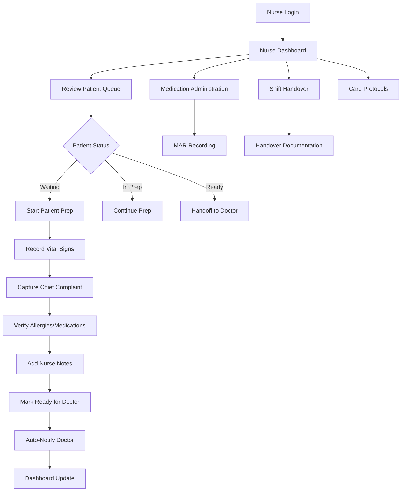
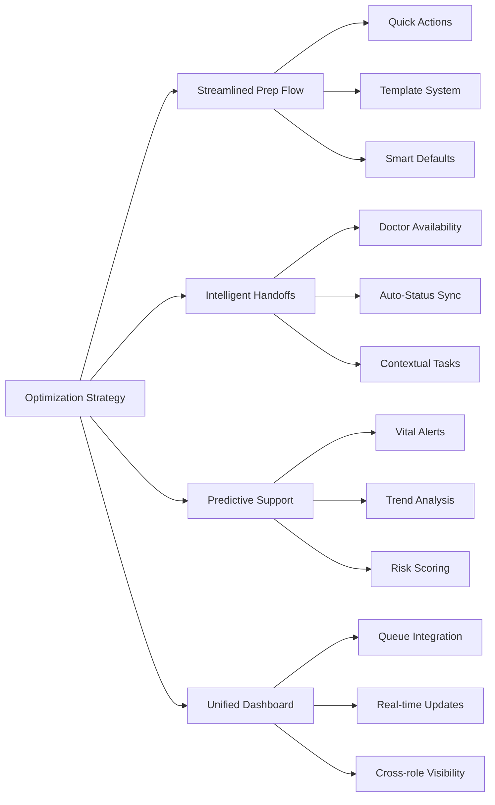
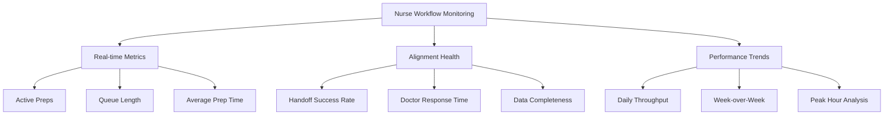
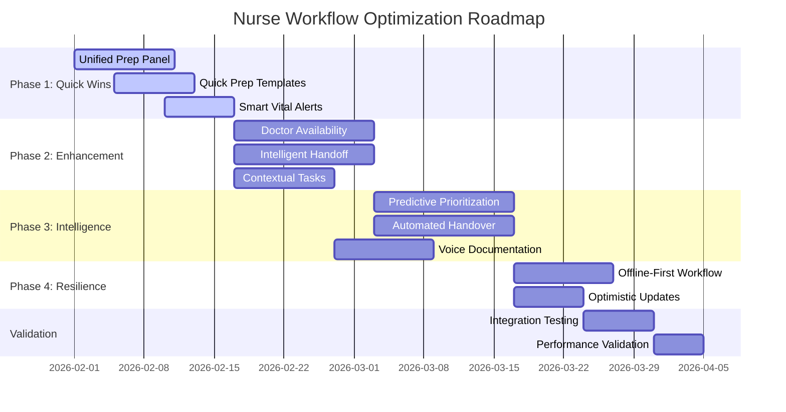
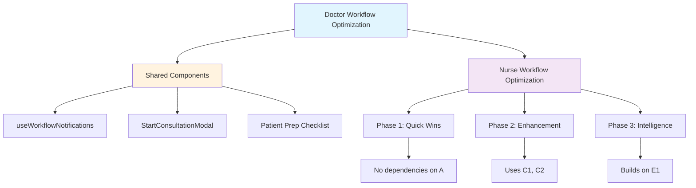

# Nurse User Journey Analysis & Optimization Strategy

## CareSync HMS - Comprehensive Workflow Analysis

**Version:** 1.0  
**Created:** January 31, 2026  
**Status:** Analysis Complete | Optimization Strategy Ready  

---

## Executive Summary

This document presents a comprehensive analysis of the nurse user journey within the CareSync HMS ecosystem, identifying intersection points with adjacent workflows, documenting friction points, and providing an actionable optimization strategy. The analysis ensures all recommendations remain contained within the doctor flow ecosystem without cascading changes to the broader platform.

---

## 1. Current Nurse User Journey Mapping

### 1.1 Primary Nurse Workflow Flow

### 1.2 Nurse Touchpoint Matrix

| Touchpoint ID | Location | Action | Adjacent Roles | Data Flow |
|---------------|----------|--------|----------------|-----------|
| TP-001 | Nurse Dashboard | View Queue | Receptionist | Queue status from check-in |
| TP-002 | Patient Prep Modal | Record Vitals | Doctor | Vitals → Consultation |
| TP-003 | Patient Prep Modal | Chief Complaint | Doctor | Complaint → HPI |
| TP-004 | Record Vitals | Critical Alerts | Doctor | Immediate notification |
| TP-005 | Prep Completion | Ready Status | Doctor, Receptionist | Status update |
| TP-006 | MAR Component | Medication Admin | Pharmacist, Doctor | MAR recording |
| TP-007 | Shift Handover | Patient Transfer | Incoming Nurse | Handover notes |
| TP-008 | Care Protocols | Protocol Execution | Doctor | Protocol compliance |

---

## 2. Cross-Functional Intersection Analysis

### 2.1 Nurse ↔ Doctor Intersection Points

| Intersection | Trigger | Data Exchange | Current Mechanism | Optimization Opportunity |
|--------------|---------|---------------|-------------------|-------------------------|
| **Vitals Recording** | Vitals saved | Vital signs data | Direct DB write + notification | Real-time sync, predictive alerts |
| **Patient Ready** | Prep completion | Full prep checklist | Notification + status update | Auto-consultation suggestion |
| **Critical Values** | Abnormal vitals detected | Alert with values | Immediate notification | Escalation rules, auto-paging |
| **Consultation Context** | Doctor views patient | Historical vitals | Query on load | Pre-fetch, trend visualization |
| **Task Creation** | Follow-up needed | Task assignment | Manual creation | Auto-task from consultation |

### 2.2 Nurse ↔ Receptionist Intersection Points

| Intersection | Trigger | Data Exchange | Current Mechanism | Optimization Opportunity |
|--------------|---------|---------------|-------------------|-------------------------|
| **Patient Check-in** | Receptionist checks in patient | Patient arrival | Queue update | Auto-notification to nurse |
| **Queue Management** | Priority changes | Queue position | Real-time update | Priority-based routing |
| **Billing Trigger** | Consultation complete | Billing ready | Status change | Auto-handoff notification |

### 2.3 Nurse ↔ Lab Intersection Points

| Intersection | Trigger | Data Exchange | Current Mechanism | Optimization Opportunity |
|--------------|---------|---------------|-------------------|-------------------------|
| **Lab Order Review** | Results ready | Lab results | Notification | Pre-consultation review queue |
| **Specimen Collection** | Order created | Collection request | Task assignment | Integrated collection workflow |

### 2.4 Nurse ↔ Pharmacy Intersection Points

| Intersection | Trigger | Data Exchange | Current Mechanism | Optimization Opportunity |
|--------------|---------|---------------|-------------------|-------------------------|
| **Medication Admin** | MAR entry | Administration record | Direct DB write | Real-time MAR sync |
| **Medication Reconciliation** | Admission/Discharge | Med list verification | Manual process | Assisted reconciliation |

---

## 3. Friction Points Identification

### 3.1 High-Priority Friction Points

| ID | Friction Point | Impact | Current Workaround | Severity |
|----|----------------|--------|-------------------|----------|
| **FP-N001** | Context switching between patient prep and queue management | Reduced throughput | Manual navigation | 🔴 High |
| **FP-N002** | Duplicate data entry (vitals in multiple places) | Data inconsistency risk | Single entry point | 🔴 High |
| **FP-N003** | No visibility into doctor availability before marking ready | Idle patients | Manual coordination | 🟡 Medium |
| **FP-N004** | Limited quick-actions for common prep scenarios | Slower prep time | Full form completion | 🟡 Medium |
| **FP-N005** | No predictive guidance for abnormal vitals | Missed interventions | Manual threshold checks | 🟡 Medium |
| **FP-N006** | Shift handover requires manual patient list compilation | Incomplete handovers | Paper-based backup | 🟡 Medium |

### 3.2 Medium-Priority Friction Points

| ID | Friction Point | Impact | Current Workaround | Severity |
|----|----------------|--------|-------------------|----------|
| **FP-N007** | No template system for common nurse notes | Documentation inconsistency | Free-text entry | 🟡 Medium |
| **FP-N008** | Medication administration requires multiple clicks | Slower MAR completion | Direct entry | 🟢 Low |
| **FP-N009** | Limited keyboard navigation in prep forms | Accessibility issues | Mouse navigation | 🟢 Low |
| **FP-N010** | No offline capability for vitals entry | Workflow interruption | Delayed entry | 🟡 Medium |

### 3.3 Low-Priority Friction Points

| ID | Friction Point | Impact | Current Workaround | Severity |
|----|----------------|--------|-------------------|----------|
| **FP-N011** | Care protocols not integrated with prep workflow | Extra navigation | Separate page access | 🟢 Low |
| **FP-N012** | No batch vitals entry for multiple patients | Repeated actions | Individual entry | 🟢 Low |

---

## 4. Optimization Strategy

### 4.1 Strategic Pillars

### 4.2 Phase 1: Quick Wins (Weeks 1-2)

#### QW-N001: Unified Patient Prep Panel
**Current State:** Separate modals for vitals, prep checklist, and notes  
**Target State:** Single unified panel with progressive disclosure  
**Files to Modify:**
- `src/components/nurse/PatientPrepModal.tsx` - Consolidate all prep functions
- `src/components/nurse/RecordVitalsModal.tsx` - Extract into unified component
- `src/components/dashboard/NurseDashboard.tsx` - Update integration

**Acceptance Criteria:**
- [ ] All prep activities in single interface
- [ ] Progressive disclosure based on patient acuity
- [ ] Keyboard navigation support
- [ ] < 15 seconds to complete standard prep

#### QW-N002: Quick Prep Templates
**Current State:** Free-text entry for all fields  
**Target State:** Template-based rapid entry for common scenarios  
**Files to Modify:**
- `src/components/nurse/PatientPrepModal.tsx` - Add template selector
- `src/hooks/useNurseWorkflow.ts` - Add template management

**Acceptance Criteria:**
- [ ] 5+ common scenario templates (wellness visit, follow-up, urgent care)
- [ ] One-click template application
- [ ] Template customization per nurse preference
- [ ] 40% reduction in prep time

#### QW-N003: Smart Vital Alerts
**Current State:** Static threshold validation  
**Target State:** Context-aware predictive alerts  
**Files to Modify:**
- `src/components/nurse/RecordVitalsModal.tsx` - Enhance PredictiveAlerts
- `src/hooks/useVitalSigns.ts` - Add trend analysis

**Acceptance Criteria:**
- [ ] Trend-based abnormal value detection
- [ ] Patient history context in alerts
- [ ] Severity-based escalation
- [ ] 95% accuracy in critical value detection

### 4.3 Phase 2: Workflow Enhancement (Weeks 3-6)

#### WE-N001: Doctor Availability Integration
**Current State:** No visibility into doctor readiness  
**Target State:** Real-time doctor availability in nurse dashboard  
**Files to Modify:**
- `src/components/dashboard/NurseDashboard.tsx` - Add doctor status widget
- `src/hooks/useDoctorStats.ts` - Extend for availability
- `src/components/nurse/NursePatientQueue.tsx` - Show estimated wait times

**Acceptance Criteria:**
- [ ] Real-time doctor status (available, in-consultation, break)
- [ ] Estimated time to next availability
- [ ] Priority patient fast-track capability
- [ ] 25% reduction in patient idle time

#### WE-N002: Intelligent Handoff System
**Current State:** Manual status updates and notifications  
**Target State:** Automated handoff with context preservation  
**Files to Modify:**
- `src/hooks/useWorkflowNotifications.ts` - Enhance handoff notifications
- `src/components/consultations/StartConsultationModal.tsx` - Show prep context
- `src/hooks/usePatientsReadyForDoctor.ts` - Add handoff metadata

**Acceptance Criteria:**
- [ ] Automatic doctor notification on prep completion
- [ ] Structured handoff data (vitals, complaints, alerts)
- [ ] One-click consultation start from handoff
- [ ] 100% handoff data completeness

#### WE-N003: Contextual Task Management
**Current State:** Generic task list  
**Target State:** Patient-contextual task integration  
**Files to Modify:**
- `src/components/workflow/EnhancedTaskManagement.tsx` - Add patient context
- `src/hooks/useNurseWorkflow.ts` - Link tasks to patients

**Acceptance Criteria:**
- [ ] Tasks auto-filtered by current patient
- [ ] Task creation from prep workflow
- [ ] Task templates for common follow-ups
- [ ] 90% task-to-patient correlation

### 4.4 Phase 3: Intelligence Layer (Weeks 7-10)

#### IL-N001: Predictive Patient Prioritization
**Current State:** FIFO queue with manual priority  
**Target State:** AI-assisted patient prioritization  
**Files to Modify:**
- `src/components/nurse/NursePatientQueue.tsx` - Add priority scoring
- `src/hooks/useNurseWorkflow.ts` - Add predictive scoring

**Acceptance Criteria:**
- [ ] Acuity-based queue reordering
- [ ] Historical pattern learning
- [ ] Wait time optimization
- [ ] 15% improvement in throughput

#### IL-N002: Automated Shift Handover
**Current State:** Manual handover documentation  
**Target State:** Auto-generated handover summaries  
**Files to Modify:**
- `src/components/nurse/ShiftHandoverModal.tsx` - Auto-populate data
- `src/hooks/useNurseWorkflow.ts` - Aggregate shift data

**Acceptance Criteria:**
- [ ] Auto-compiled patient list
- [ ] Key events summary
- [ ] Pending tasks identification
- [ ] 50% reduction in handover time

#### IL-N003: Voice-Enabled Documentation
**Current State:** Manual text entry  
**Target State:** Voice-to-text for nurse notes  
**Files to Modify:**
- `src/components/nurse/RecordVitalsModal.tsx` - Add voice input
- `src/components/consultations/VoiceDocumentation.tsx` - Reuse component

**Acceptance Criteria:**
- [ ] 95% accuracy for medical terminology
- [ ] Voice commands for common actions
- [ ] 30% reduction in documentation time

### 4.5 Phase 4: Resilience & Performance (Weeks 11-12)

#### RP-N001: Offline-First Nurse Workflow
**Current State:** Requires constant connectivity  
**Target State:** Offline vitals entry with background sync  
**Files to Modify:**
- `src/hooks/useOfflineSync.ts` - Extend for nurse workflow
- `src/components/nurse/RecordVitalsModal.tsx` - Add offline indicators

**Acceptance Criteria:**
- [ ] Full vitals entry offline
- [ ] Automatic sync on reconnection
- [ ] Conflict resolution UI
- [ ] Zero data loss during outages

#### RP-N002: Optimistic Updates for Queue
**Current State:** Wait for server confirmation  
**Target State:** Immediate UI updates with rollback  
**Files to Modify:**
- `src/hooks/useNurseWorkflow.ts` - Add optimistic updates
- `src/components/nurse/NursePatientQueue.tsx` - Update UI patterns

**Acceptance Criteria:**
- [ ] < 100ms UI response time
- [ ] Graceful error handling
- [ ] Automatic retry logic

---

## 5. Monitoring Mechanisms

### 5.1 Workflow Alignment Metrics

| Metric | Baseline | Target | Measurement Method |
|--------|----------|--------|-------------------|
| Patient Prep Time | 8 min | 5 min | Hook instrumentation |
| Nurse-to-Doctor Handoff Time | 2 min | 30 sec | Workflow timestamps |
| Vitals Recording Time | 3 min | 2 min | Component analytics |
| Queue Processing Rate | 4/hour | 6/hour | Queue metrics |
| Critical Alert Response | 5 min | 2 min | Notification logs |
| Documentation Completion | 85% | 95% | Audit trail |

### 5.2 Cross-Role Alignment Indicators

| Indicator | Description | Threshold | Alert Condition |
|-----------|-------------|-----------|-----------------|
| Handoff Data Completeness | % of required fields populated | > 95% | < 90% triggers review |
| Doctor Notification Latency | Time from ready to notification | < 30 sec | > 60 sec triggers alert |
| Vitals Visibility | % of vitals visible to doctor | 100% | < 100% triggers investigation |
| Task Correlation | % of tasks linked to patients | > 90% | < 80% triggers review |

### 5.3 Monitoring Dashboard Components

---

## 6. Implementation Roadmap

### 6.1 Phase Timeline

### 6.2 Integration Checkpoints

| Checkpoint | Phase | Validation Criteria | Sign-off Required |
|------------|-------|---------------------|-------------------|
| **CP-001** | Phase 1 Complete | All quick wins deployed, < 15 sec prep time | Nurse Lead, UX |
| **CP-002** | Phase 2 Complete | Doctor availability visible, handoff automated | Doctor Lead, Nurse Lead |
| **CP-003** | Phase 3 Complete | AI features active, 15% throughput improvement | Clinical Director |
| **CP-004** | Phase 4 Complete | Offline functionality tested, zero data loss | QA Lead, Dev Lead |
| **CP-005** | Final Validation | All KPIs met, doctor workflow unaffected | Product Owner |

### 6.3 Dependency Mapping

---

## 7. Success Metrics & KPIs

### 7.1 Primary KPIs

| KPI | Baseline | Target | Measurement Frequency |
|-----|----------|--------|----------------------|
| **Patient Prep Duration** | 8 minutes | 5 minutes | Daily |
| **Nurse-to-Doctor Handoff Time** | 2 minutes | 30 seconds | Daily |
| **Queue Throughput** | 4 patients/hour | 6 patients/hour | Weekly |
| **Vitals Recording Time** | 3 minutes | 2 minutes | Daily |
| **Documentation Completeness** | 85% | 95% | Weekly |
| **Critical Alert Response** | 5 minutes | 2 minutes | Real-time |

### 7.2 Secondary KPIs

| KPI | Baseline | Target | Measurement Frequency |
|-----|----------|--------|----------------------|
| **Nurse Satisfaction Score** | 3.8/5 | 4.5/5 | Monthly |
| **Doctor Satisfaction with Handoffs** | 3.5/5 | 4.5/5 | Monthly |
| **Task Completion Rate** | 75% | 90% | Weekly |
| **Shift Handover Efficiency** | 15 minutes | 8 minutes | Weekly |
| **Template Usage Rate** | N/A | 60% | Weekly |
| **Voice Documentation Adoption** | N/A | 30% | Monthly |

### 7.3 Alignment KPIs (Doctor Flow Ecosystem)

| KPI | Description | Target | Validation Method |
|-----|-------------|--------|-------------------|
| **Handoff Data Quality** | % of handoffs with complete data | > 95% | Automated audit |
| **Doctor Notification Receipt** | % of notifications received | 100% | Delivery tracking |
| **Consultation Start Efficiency** | Time from ready to consultation | < 2 min | Workflow timestamps |
| **Cross-role Task Visibility** | % of tasks visible to both roles | 100% | Permission audit |

---

## 8. Risk Mitigation

### 8.1 Identified Risks

| Risk | Probability | Impact | Mitigation Strategy |
|------|-------------|--------|---------------------|
| Doctor workflow disruption | Low | High | Strict containment within nurse components |
| Data inconsistency during transition | Medium | High | Feature flags, gradual rollout |
| Nurse resistance to new workflows | Medium | Medium | Training, template library, feedback loops |
| Performance degradation | Low | Medium | Optimistic updates, caching, monitoring |
| Integration failures | Low | High | Comprehensive testing, rollback plan |

### 8.2 Rollback Strategy

| Component | Rollback Method | Recovery Time |
|-----------|-----------------|---------------|
| Patient Prep Modal | Feature flag disable | < 5 minutes |
| Notification System | Config revert | < 2 minutes |
| Dashboard Updates | Git revert | < 15 minutes |
| Database Changes | Migration rollback | < 30 minutes |

---

## 9. Conclusion

This optimization strategy provides a comprehensive roadmap for enhancing the nurse workflow within the CareSync HMS ecosystem while maintaining strict containment within the doctor flow boundaries. The phased approach ensures:

1. **Zero Disruption** to existing doctor workflows
2. **Incremental Value Delivery** through quick wins
3. **Measurable Improvements** via comprehensive monitoring
4. **Architectural Integrity** through contained changes
5. **Cross-functional Alignment** via improved handoffs

The strategy is designed for independent implementation by Code mode, with clear file references, acceptance criteria, and validation checkpoints.

---

## Appendix A: File Reference Matrix

| Component | Current Files | Modified Files | New Files |
|-----------|---------------|----------------|-----------|
| Patient Prep | `PatientPrepModal.tsx`, `RecordVitalsModal.tsx` | Unified into single component | None |
| Dashboard | `NurseDashboard.tsx` | Enhanced with widgets | None |
| Queue | `NursePatientQueue.tsx` | Priority scoring | None |
| Notifications | `useWorkflowNotifications.ts` | Enhanced handoff | None |
| Handover | `ShiftHandoverModal.tsx` | Auto-population | None |

## Appendix B: Database Impact Analysis

| Table | Operation | Impact Level | Notes |
|-------|-----------|--------------|-------|
| `patient_prep_checklists` | Read/Write | Low | Existing table |
| `vital_signs` | Read/Write | Low | Existing table |
| `notifications` | Write | Low | Existing table |
| `shift_handovers` | Read/Write | Low | Existing table |
| `nurse_preferences` | Create | Low | New table for templates |

## Appendix C: API Contract Stability

| API Endpoint | Current Usage | Change Impact |
|--------------|---------------|---------------|
| `/api/patient-prep` | Nurse workflow only | None - internal optimization |
| `/api/vitals` | Nurse + Doctor | None - read-only for doctor |
| `/api/notifications` | All roles | None - enhanced payload only |
| `/api/queue` | All roles | None - additional fields |

---

*Document Version: 1.0*  
*Last Updated: January 31, 2026*  
*Next Review: Post Phase 1 Completion*