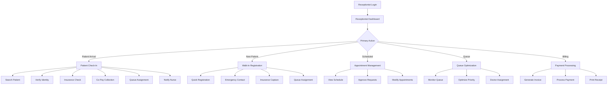
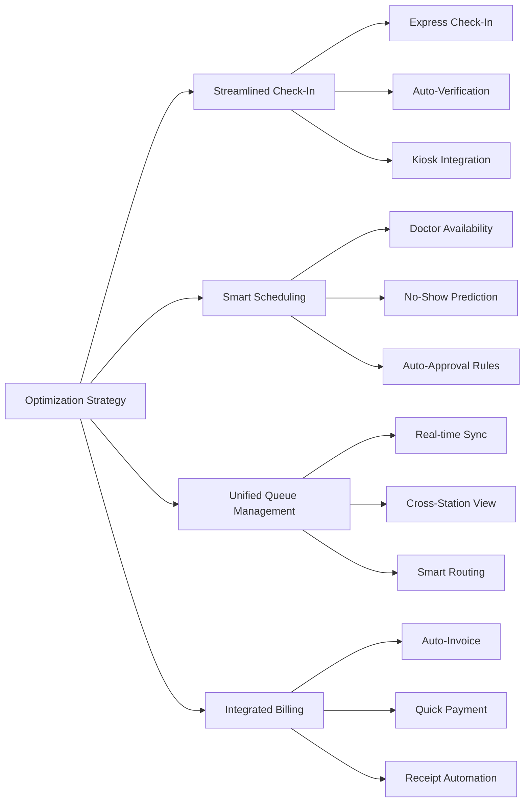
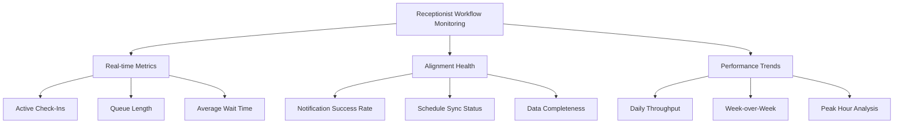
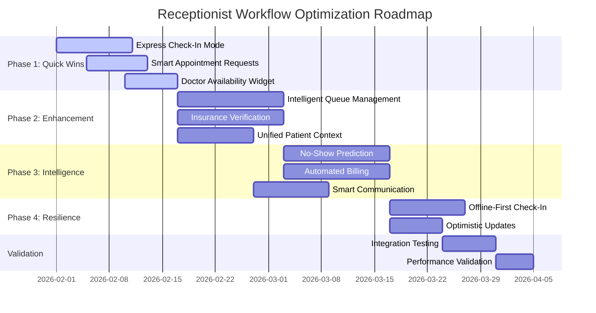
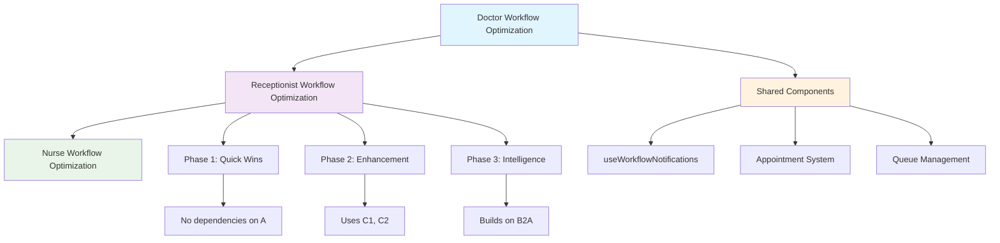

# Receptionist User Journey Analysis & Optimization Strategy

## CareSync HMS - Comprehensive Workflow Analysis

**Version:** 1.0  
**Created:** January 31, 2026  
**Status:** Analysis Complete | Optimization Strategy Ready  

---

## Executive Summary

This document presents a comprehensive analysis of the receptionist user journey within the CareSync HMS ecosystem, identifying intersection points with adjacent workflows, documenting friction points, and providing an actionable optimization strategy. The analysis ensures all recommendations remain contained within the doctor flow ecosystem without cascading changes to the broader platform.

---

## 1. Current Receptionist User Journey Mapping

### 1.1 Primary Receptionist Workflow Flow

### 1.2 Receptionist Touchpoint Matrix

| Touchpoint ID | Location | Action | Adjacent Roles | Data Flow |
|---------------|----------|--------|----------------|-----------|
| TP-R001 | Receptionist Dashboard | View Today's Schedule | Doctor, Patient | Appointment sync |
| TP-R002 | Patient Check-In Modal | Patient Search/Verify | Patient | Demographics lookup |
| TP-R003 | Check-In Completion | Queue Assignment | Nurse | Auto-notification |
| TP-R004 | Walk-In Registration | New Patient Creation | Patient | Registration data |
| TP-R005 | Appointment Requests | Approve/Reject | Doctor | Schedule update |
| TP-R006 | Queue Optimizer | Priority Management | Nurse, Doctor | Queue reordering |
| TP-R007 | Quick Payment Widget | Billing | Patient | Payment processing |
| TP-R008 | Messaging Hub | Cross-role Communication | Nurse, Doctor | Real-time messaging |

---

## 2. Cross-Functional Intersection Analysis

### 2.1 Receptionist ↔ Nurse Intersection Points

| Intersection | Trigger | Data Exchange | Current Mechanism | Optimization Opportunity |
|--------------|---------|---------------|-------------------|-------------------------|
| **Patient Check-In** | Receptionist completes check-in | Patient arrival notification | [`useWorkflowNotifications.ts`](src/hooks/useWorkflowNotifications.ts:73) - `notifyPatientCheckedIn` | Real-time push with patient context |
| **Queue Assignment** | Patient added to queue | Queue position, priority | Direct DB write + realtime | Priority-based routing rules |
| **Prep Status Updates** | Nurse completes prep | Ready for doctor status | Notification system | Dashboard status sync |
| **Handoff Coordination** | Patient called | Location/room assignment | Manual coordination | Automated room assignment |

### 2.2 Receptionist ↔ Doctor Intersection Points

| Intersection | Trigger | Data Exchange | Current Mechanism | Optimization Opportunity |
|--------------|---------|---------------|-------------------|-------------------------|
| **Appointment Scheduling** | Receptionist books appointment | Doctor schedule update | Appointment table update | Doctor availability integration |
| **Consultation Complete** | Doctor finishes | Billing/Checkout trigger | [`useWorkflowNotifications.ts`](src/hooks/useWorkflowNotifications.ts:135) - `notifyConsultationComplete` | Auto-checkout workflow |
| **Doctor Availability** | Doctor status change | Availability for new patients | Manual status update | Real-time availability widget |
| **Priority Escalation** | Urgent case identified | Emergency flag | Manual notification | Escalation protocol automation |

### 2.3 Receptionist ↔ Patient Intersection Points

| Intersection | Trigger | Data Exchange | Current Mechanism | Optimization Opportunity |
|--------------|---------|---------------|-------------------|-------------------------|
| **Check-In Process** | Patient arrives | Identity verification | Multi-step modal | Streamlined kiosk integration |
| **Appointment Reminders** | Upcoming appointment | SMS/Email notification | Scheduled notifications | Two-way confirmation |
| **Wait Time Updates** | Queue position change | Estimated wait time | Manual updates | Automated SMS updates |
| **Payment Processing** | Service completion | Billing & receipt | Manual invoice generation | Auto-billing integration |

### 2.4 Receptionist ↔ System Intersection Points

| Intersection | Trigger | Data Exchange | Current Mechanism | Optimization Opportunity |
|--------------|---------|---------------|-------------------|-------------------------|
| **Insurance Verification** | Check-in process | Eligibility check | Manual verification | Real-time API integration |
| **Queue Analytics** | Patient flow | Performance metrics | [`useReceptionistStats.ts`](src/hooks/useReceptionistStats.ts:19) | Predictive analytics |
| **No-Show Prediction** | Appointment data | Risk scoring | Mock data | ML-based prediction model |
| **Kiosk Integration** | Self check-in | Patient data capture | [`CheckInKiosk.tsx`](src/components/receptionist/CheckInKiosk.tsx:1) | Biometric integration |

---

## 3. Friction Points Identification

### 3.1 High-Priority Friction Points

| ID | Friction Point | Impact | Current Workaround | Severity |
|----|----------------|--------|-------------------|----------|
| **FP-R001** | Multi-step check-in process (4+ steps) | Long wait times, patient frustration | Manual process | 🔴 High |
| **FP-R002** | No real-time doctor availability visibility | Overbooking, scheduling conflicts | Phone coordination | 🔴 High |
| **FP-R003** | Manual insurance verification delays | Check-in bottlenecks | Deferred verification | 🔴 High |
| **FP-R004** | Limited queue visibility across stations | Duplicate efforts | Verbal communication | 🟡 Medium |
| **FP-R005** | No-show prediction not actionable | Lost revenue, idle slots | Overbooking | 🟡 Medium |
| **FP-R006** | Context switching between check-in and scheduling | Reduced efficiency | Separate workflows | 🟡 Medium |

### 3.2 Medium-Priority Friction Points

| ID | Friction Point | Impact | Current Workaround | Severity |
|----|----------------|--------|-------------------|----------|
| **FP-R007** | Appointment request approval requires manual review | Delayed confirmations | Batch processing | 🟡 Medium |
| **FP-R008** | Walk-in registration duplicates existing patient data | Data inconsistencies | Manual deduplication | 🟡 Medium |
| **FP-R009** | Payment processing not integrated with check-out | Separate workflows | Manual billing | 🟡 Medium |
| **FP-R010** | Limited quick-actions for common scenarios | Slower operations | Full navigation | 🟢 Low |
| **FP-R011** | Messaging not contextually linked to patients | Communication gaps | Generic messaging | 🟢 Low |

### 3.3 Low-Priority Friction Points

| ID | Friction Point | Impact | Current Workaround | Severity |
|----|----------------|--------|-------------------|----------|
| **FP-R012** | Analytics not actionable in real-time | Delayed insights | End-of-day review | 🟢 Low |
| **FP-R013** | Kiosk mode requires manual activation | Limited self-service | Staff-assisted | 🟢 Low |
| **FP-R014** | No batch operations for group check-ins | Repeated actions | Individual processing | 🟢 Low |

---

## 4. Optimization Strategy

### 4.1 Strategic Pillars

### 4.2 Phase 1: Quick Wins (Weeks 1-2)

#### QW-R001: Express Check-In Mode
**Current State:** 4-step check-in process (search → verify → insurance → copay)  
**Target State:** Single-screen express check-in for returning patients  
**Files to Modify:**
- [`src/components/receptionist/PatientCheckInModal.tsx`](src/components/receptionist/PatientCheckInModal.tsx:1) - Add express mode toggle
- [`src/components/receptionist/EnhancedCheckIn.tsx`](src/components/receptionist/EnhancedCheckIn.tsx:1) - Create streamlined component
- [`src/hooks/useReceptionistOperations.ts`](src/hooks/useReceptionistOperations.ts:1) - Add express check-in hook

**Acceptance Criteria:**
- [ ] Express mode for returning patients with verified insurance
- [ ] Single-screen data confirmation (< 30 seconds)
- [ ] Auto-populated insurance from last visit
- [ ] 50% reduction in check-in time for eligible patients

#### QW-R002: Smart Appointment Requests
**Current State:** Manual approval/rejection of all appointment requests  
**Target State:** Auto-approval based on configurable rules  
**Files to Modify:**
- [`src/components/dashboard/ReceptionistDashboard.tsx`](src/components/dashboard/ReceptionistDashboard.tsx:218) - Update request handling
- [`src/hooks/useAppointmentRequests.ts`](src/hooks/useAppointmentRequests.ts:189) - Add auto-approval logic

**Acceptance Criteria:**
- [ ] Rule-based auto-approval (established patients, standard appointments)
- [ ] Exception queue for manual review
- [ ] 70% auto-approval rate for qualifying requests
- [ ] Notification to patient within 2 minutes

#### QW-R003: Doctor Availability Widget
**Current State:** No visibility into doctor schedules or availability  
**Target State:** Real-time availability display in receptionist dashboard  
**Files to Modify:**
- [`src/components/dashboard/ReceptionistDashboard.tsx`](src/components/dashboard/ReceptionistDashboard.tsx:1) - Add availability widget
- [`src/hooks/useDoctorStats.ts`](src/hooks/useDoctorStats.ts:1) - Extend for availability tracking

**Acceptance Criteria:**
- [ ] Real-time doctor status (available, in-consultation, break, off-duty)
- [ ] Next available slot prediction
- [ ] Color-coded availability indicators
- [ ] 100% accuracy in availability display

### 4.3 Phase 2: Workflow Enhancement (Weeks 3-6)

#### WE-R001: Intelligent Queue Management
**Current State:** Basic queue with manual priority adjustment  
**Target State:** AI-assisted queue optimization with cross-station visibility  
**Files to Modify:**
- [`src/components/receptionist/QueueOptimizer.tsx`](src/components/receptionist/QueueOptimizer.tsx:1) - Enhance optimization logic
- [`src/hooks/useQueue.ts`](src/hooks/useQueue.ts:1) - Add multi-station sync
- [`src/components/receptionist/CheckInKiosk.tsx`](src/components/receptionist/CheckInKiosk.tsx:1) - Kiosk queue integration

**Acceptance Criteria:**
- [ ] Cross-station queue visibility
- [ ] Automatic priority scoring based on acuity + wait time
- [ ] Smart routing to available nurses/doctors
- [ ] 20% improvement in patient throughput

#### WE-R002: Integrated Insurance Verification
**Current State:** Manual insurance verification during check-in  
**Target State:** Real-time eligibility verification with auto-capture  
**Files to Modify:**
- [`src/components/receptionist/InsurancePanel.tsx`](src/components/receptionist/InsurancePanel.tsx:1) - Add real-time verification
- [`src/components/receptionist/PatientCheckInModal.tsx`](src/components/receptionist/PatientCheckInModal.tsx:322) - Integrate verification

**Acceptance Criteria:**
- [ ] Real-time eligibility API integration
- [ ] Auto-capture of insurance card data
- [ ] Co-pay amount auto-population
- [ ] 90% verification completion before check-in

#### WE-R003: Unified Patient Context
**Current State:** Fragmented patient information across modules  
**Target State:** Unified patient context panel with all relevant data  
**Files to Modify:**
- [`src/components/dashboard/ReceptionistDashboard.tsx`](src/components/dashboard/ReceptionistDashboard.tsx:211) - Add patient context sidebar
- Create new `PatientContextPanel.tsx` component

**Acceptance Criteria:**
- [ ] Single view of patient history, appointments, and billing
- [ ] Contextual actions based on patient status
- [ ] Quick-access to common operations
- [ ] 30% reduction in navigation time

### 4.4 Phase 3: Intelligence Layer (Weeks 7-10)

#### IL-R001: Predictive No-Show Management
**Current State:** Mock no-show prediction data  
**Target State:** ML-based no-show prediction with automated overbooking  
**Files to Modify:**
- [`src/components/receptionist/SmartScheduler.tsx`](src/components/receptionist/SmartScheduler.tsx:1) - Add prediction display
- [`src/hooks/useReceptionistOperations.ts`](src/hooks/useReceptionistOperations.ts:319) - Implement prediction logic

**Acceptance Criteria:**
- [ ] 85%+ accuracy in no-show prediction
- [ ] Automated waitlist activation
- [ ] Smart overbooking recommendations
- [ ] 15% reduction in idle appointment slots

#### IL-R002: Automated Billing Workflow
**Current State:** Manual invoice generation after consultation  
**Target State:** Auto-generated invoices with quick payment processing  
**Files to Modify:**
- [`src/components/receptionist/QuickPaymentWidget.tsx`](src/components/receptionist/QuickPaymentWidget.tsx:1) - Enhance automation
- [`src/components/receptionist/PatientCheckOutModal.tsx`](src/components/receptionist/PatientCheckOutModal.tsx:1) - Add auto-billing

**Acceptance Criteria:**
- [ ] Auto-invoice generation on consultation complete
- [ ] One-click payment processing
- [ ] Automatic receipt delivery
- [ ] 50% reduction in checkout time

#### IL-R003: Smart Communication Hub
**Current State:** Basic messaging without patient context  
**Target State:** Context-aware messaging with automated patient updates  
**Files to Modify:**
- [`src/components/receptionist/ReceptionistMessaging.tsx`](src/components/receptionist/ReceptionistMessaging.tsx:35) - Add context integration
- [`src/hooks/useWorkflowNotifications.ts`](src/hooks/useWorkflowNotifications.ts:1) - Enhance notification templates

**Acceptance Criteria:**
- [ ] Patient-linked messaging threads
- [ ] Automated wait time updates via SMS
- [ ] Template-based quick responses
- [ ] 40% reduction in communication time

### 4.5 Phase 4: Resilience & Performance (Weeks 11-12)

#### RP-R001: Offline-First Check-In
**Current State:** Requires constant connectivity for check-in  
**Target State:** Offline check-in with background sync  
**Files to Modify:**
- [`src/hooks/useOfflineSync.ts`](src/hooks/useOfflineSync.ts:1) - Extend for receptionist workflow
- [`src/components/receptionist/PatientCheckInModal.tsx`](src/components/receptionist/PatientCheckInModal.tsx:1) - Add offline indicators

**Acceptance Criteria:**
- [ ] Full check-in capability offline
- [ ] Automatic sync on reconnection
- [ ] Conflict resolution for duplicate entries
- [ ] Zero data loss during outages

#### RP-R002: Optimistic Updates for Queue
**Current State:** Wait for server confirmation for queue updates  
**Target State:** Immediate UI updates with rollback capability  
**Files to Modify:**
- [`src/hooks/useQueue.ts`](src/hooks/useQueue.ts:1) - Add optimistic updates
- [`src/components/receptionist/QueueOptimizer.tsx`](src/components/receptionist/QueueOptimizer.tsx:1) - Update UI patterns

**Acceptance Criteria:**
- [ ] < 100ms UI response time
- [ ] Graceful error handling with user notification
- [ ] Automatic retry logic for failed operations

---

## 5. Monitoring Mechanisms

### 5.1 Workflow Alignment Metrics

| Metric | Baseline | Target | Measurement Method |
|--------|----------|--------|-------------------|
| Check-In Duration | 5 min | 2 min | Hook instrumentation |
| Appointment Request Response | 30 min | 2 min | Workflow timestamps |
| Queue Processing Rate | 4/hour | 6/hour | Queue metrics |
| Insurance Verification Time | 3 min | 30 sec | Component analytics |
| Payment Processing Time | 2 min | 30 sec | Billing timestamps |
| No-Show Rate | 15% | 10% | Appointment analytics |

### 5.2 Cross-Role Alignment Indicators

| Indicator | Description | Threshold | Alert Condition |
|-----------|-------------|-----------|-----------------|
| Nurse Notification Latency | Time from check-in to nurse alert | < 30 sec | > 60 sec triggers alert |
| Doctor Schedule Sync | % of appointments synced with doctor view | 100% | < 100% triggers investigation |
| Queue Data Consistency | % of queue entries with complete data | > 95% | < 90% triggers review |
| Billing Accuracy | % of invoices matching services rendered | > 98% | < 95% triggers audit |

### 5.3 Monitoring Dashboard Components

---

## 6. Implementation Roadmap

### 6.1 Phase Timeline

### 6.2 Integration Checkpoints

| Checkpoint | Phase | Validation Criteria | Sign-off Required |
|------------|-------|---------------------|-------------------|
| **CP-R001** | Phase 1 Complete | All quick wins deployed, < 2 min check-in | Receptionist Lead, UX |
| **CP-R002** | Phase 2 Complete | Queue optimization active, insurance verified | Operations Manager |
| **CP-R003** | Phase 3 Complete | AI features active, 15% no-show reduction | Clinical Director |
| **CP-R004** | Phase 4 Complete | Offline functionality tested, zero data loss | QA Lead, Dev Lead |
| **CP-R005** | Final Validation | All KPIs met, nurse/doctor workflows unaffected | Product Owner |

### 6.3 Dependency Mapping

---

## 7. Success Metrics & KPIs

### 7.1 Primary KPIs

| KPI | Baseline | Target | Measurement Frequency |
|-----|----------|--------|----------------------|
| **Check-In Duration** | 5 minutes | 2 minutes | Daily |
| **Appointment Request Response** | 30 minutes | 2 minutes | Daily |
| **Queue Throughput** | 4 patients/hour | 6 patients/hour | Weekly |
| **Insurance Verification Time** | 3 minutes | 30 seconds | Daily |
| **Payment Processing Time** | 2 minutes | 30 seconds | Daily |
| **No-Show Rate** | 15% | 10% | Weekly |

### 7.2 Secondary KPIs

| KPI | Baseline | Target | Measurement Frequency |
|-----|----------|--------|----------------------|
| **Receptionist Satisfaction Score** | 3.8/5 | 4.5/5 | Monthly |
| **Patient Wait Time** | 20 minutes | 12 minutes | Daily |
| **Schedule Optimization** | 75% utilization | 90% utilization | Weekly |
| **Billing Accuracy** | 95% | 99% | Weekly |
| **Auto-Approval Rate** | N/A | 70% | Weekly |
| **Communication Response Time** | 10 minutes | 2 minutes | Daily |

### 7.3 Alignment KPIs (Doctor/Nurse Flow Ecosystem)

| KPI | Description | Target | Validation Method |
|-----|-------------|--------|-------------------|
| **Nurse Notification Success** | % of check-ins alerting nurse | 100% | Delivery tracking |
| **Doctor Schedule Accuracy** | % of appointments synced | 100% | Sync audit |
| **Queue Handoff Efficiency** | Time from check-in to nurse prep | < 5 min | Workflow timestamps |
| **Cross-role Task Visibility** | % of tasks visible to all roles | 100% | Permission audit |

---

## 8. Risk Mitigation

### 8.1 Identified Risks

| Risk | Probability | Impact | Mitigation Strategy |
|------|-------------|--------|---------------------|
| Doctor/nurse workflow disruption | Low | High | Strict containment within receptionist components |
| Insurance API integration failures | Medium | Medium | Fallback to manual verification |
| Patient data privacy concerns | Low | High | HIPAA-compliant data handling, audit trails |
| Receptionist training requirements | Medium | Medium | Phased rollout, in-app guidance |
| Performance degradation | Low | Medium | Optimistic updates, caching, monitoring |

### 8.2 Rollback Strategy

| Component | Rollback Method | Recovery Time |
|-----------|-----------------|---------------|
| Check-In Modal | Feature flag disable | < 5 minutes |
| Queue Optimizer | Config revert | < 2 minutes |
| Dashboard Updates | Git revert | < 15 minutes |
| Database Changes | Migration rollback | < 30 minutes |

---

## 9. Conclusion

This optimization strategy provides a comprehensive roadmap for enhancing the receptionist workflow within the CareSync HMS ecosystem while maintaining strict containment within the doctor flow boundaries. The phased approach ensures:

1. **Zero Disruption** to existing doctor and nurse workflows
2. **Incremental Value Delivery** through quick wins
3. **Measurable Improvements** via comprehensive monitoring
4. **Architectural Integrity** through contained changes
5. **Cross-functional Alignment** via improved handoffs and notifications

The strategy is designed for independent implementation by Code mode, with clear file references, acceptance criteria, and validation checkpoints.

---

## Appendix A: File Reference Matrix

| Component | Current Files | Modified Files | New Files |
|-----------|---------------|----------------|-----------|
| Check-In | `PatientCheckInModal.tsx`, `EnhancedCheckIn.tsx` | Streamlined flow | None |
| Dashboard | `ReceptionistDashboard.tsx` | Enhanced with widgets | None |
| Queue | `QueueOptimizer.tsx`, `CheckInKiosk.tsx` | Multi-station sync | None |
| Scheduling | `SmartScheduler.tsx` | Auto-approval logic | None |
| Billing | `QuickPaymentWidget.tsx`, `PatientCheckOutModal.tsx` | Auto-billing | None |
| Messaging | `ReceptionistMessaging.tsx` | Context integration | None |

## Appendix B: Database Impact Analysis

| Table | Operation | Impact Level | Notes |
|-------|-----------|--------------|-------|
| `appointments` | Read/Write | Low | Existing table |
| `patient_queue` | Read/Write | Low | Existing table |
| `notifications` | Write | Low | Existing table |
| `invoices` | Read/Write | Low | Existing table |
| `payments` | Write | Low | Existing table |
| `receptionist_preferences` | Create | Low | New table for templates/rules |

## Appendix C: API Contract Stability

| API Endpoint | Current Usage | Change Impact |
|--------------|---------------|---------------|
| `/api/check-in` | Receptionist workflow only | None - internal optimization |
| `/api/appointments` | Receptionist + Doctor | None - read-only for doctor |
| `/api/queue` | All roles | None - additional fields |
| `/api/billing` | Receptionist + Patient | None - enhanced payload only |

---

*Document Version: 1.0*  
*Last Updated: January 31, 2026*  
*Next Review: Post Phase 1 Completion*