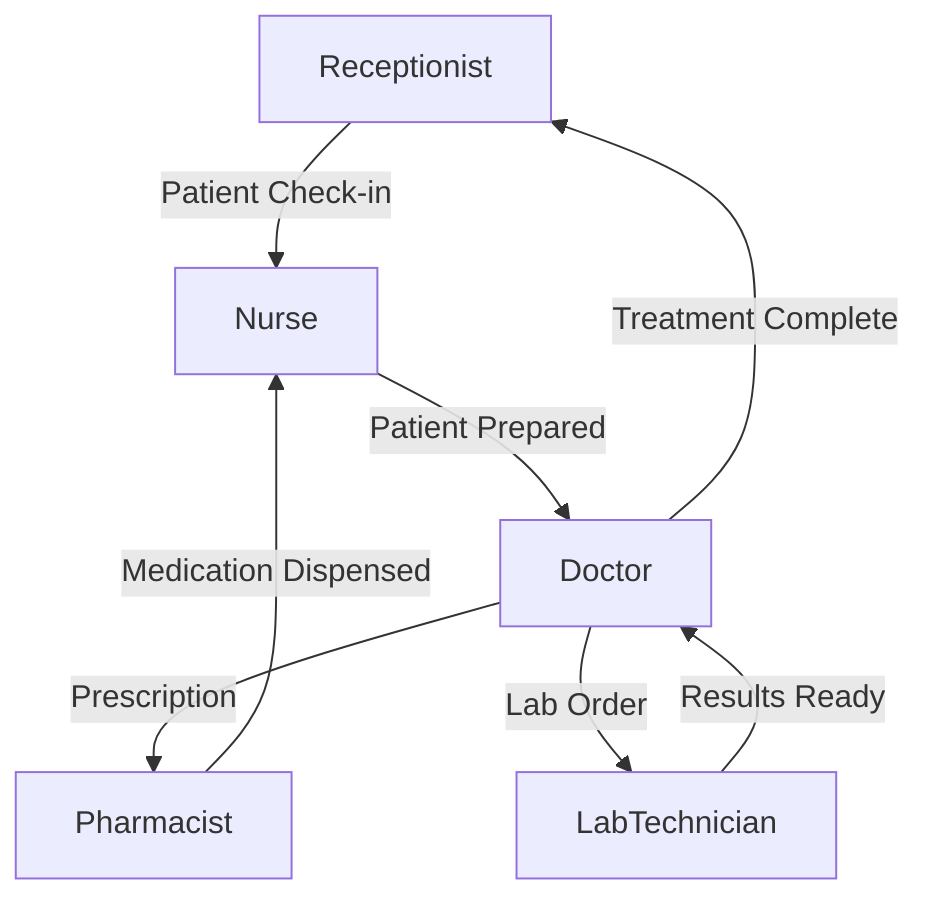

# Care Harmony Hub Workflow Optimization Plan

## 1. Current System Analysis

### System Architecture Overview
- **Frontend**: React SPA with role-based dashboards (7 roles)
- **Backend**: Supabase (PostgreSQL + Edge Functions)
- **Roles**: Admin, Doctor, Nurse, Receptionist, Pharmacist, Lab Technician, Patient
- **Core Features**: Task management, cross-role communication, workflow automation, clinical workflows

### Current Workflow Challenges

#### Bottlenecks Identified:
1. **Fragmented Communication**: Messages and notifications scattered across different systems
2. **Inefficient Task Assignment**: Manual task routing with limited automation
3. **Data Silos**: Information not shared effectively between roles
4. **Lack of Real-time Updates**: Delays in status changes and patient data updates
5. **Complex Handoff Processes**: Unclear responsibilities during role transitions
6. **Limited Analytics**: No comprehensive workflow performance tracking

## 2. Optimization Strategies

### 2.1 Role Responsibilities and Handoff Processes

#### Clear Role Definitions:
- **Admin**: System configuration, user management, analytics
- **Receptionist**: Patient registration, appointment scheduling, check-in
- **Nurse**: Triage, vitals recording, patient preparation, medication reconciliation
- **Doctor**: Consultation, diagnosis, treatment planning, prescriptions
- **Pharmacist**: Medication dispensing, drug safety checks, inventory management
- **Lab Technician**: Lab testing, result entry, sample tracking
- **Patient**: Portal access, appointments, prescriptions, messaging

#### Standardized Handoff Processes:

### 2.2 Collaborative Tools Enhancement

#### Real-time Communication Hub:
- **Unified Inbox**: Aggregate all messages, notifications, and alerts
- **Role-specific Channels**: Dedicated communication for each role
- **Message Threading**: Contextual conversations around patients/tasks
- **File Sharing**: Secure document exchange within communication threads

#### Task Management Improvements:
- **Intelligent Task Router**: Automated task assignment based on role, priority, and workload
- **Task Templates**: Pre-defined task types for common workflows
- **Status Tracking**: Real-time task status with progress indicators
- **Escalation Rules**: Automatic task escalation for overdue items

### 2.3 Workflow Automation

#### Automated Task Triggers:
- **Patient Check-in**: Auto-create nurse triage task
- **Lab Order**: Auto-assign to lab technician
- **Prescription**: Auto-send to pharmacy
- **Critical Results**: Auto-alert doctor with urgent notification

#### Workflow Rules Engine:
- **Custom Rule Creation**: Admin-defined automation rules
- **Condition-based Actions**: Trigger actions based on specific events
- **Rule Testing**: Sandbox environment for rule validation
- **Performance Metrics**: Track automation efficiency

### 2.4 Role-Specific Dashboards

#### Enhanced Dashboard Features:
- **Priority-based Views**: Filter tasks by urgency
- **Patient Context**: Quick access to relevant patient information
- **Workflow Status**: Visual representation of current tasks
- **Actionable Insights**: Performance metrics and bottleneck alerts

#### Dashboard Layout Optimization:
- **Doctor Dashboard**: Focus on patient visits, lab results, prescriptions
- **Nurse Dashboard**: Emphasize triage, vitals, medication administration
- **Pharmacist Dashboard**: Highlight prescriptions, inventory, drug safety
- **Receptionist Dashboard**: Prioritize appointments, check-in, billing

### 2.5 Data Sharing and Synchronization

#### Real-time Data Updates:
- **Patient Records**: Synchronized across all role views
- **Task Status**: Immediate updates when task is modified
- **Lab Results**: Auto-update in doctor and patient portals
- **Prescriptions**: Real-time status changes from pharmacy

#### Secure Data Exchange:
- **Role-based Permissions**: Granular access control
- **Audit Trails**: Complete history of data access and modifications
- **Data Encryption**: End-to-end encryption for sensitive information

### 2.6 Performance Monitoring

#### Workflow Analytics:
- **Task Completion Rates**: Track role-specific performance
- **Average Completion Time**: Identify bottlenecks
- **Overdue Task Analysis**: Root cause identification
- **Automation Efficiency**: Measure time saved by automation

#### Bottleneck Detection:
- **Real-time Alerts**: Notify admins of workflow bottlenecks
- **Performance Metrics**: Visual dashboards with KPI tracking
- **Trend Analysis**: Predict future bottlenecks based on historical data

## 3. Implementation Plan

### Phase 1: Foundation (Weeks 1-2)
- [ ] Define detailed role responsibilities and handoff processes
- [ ] Design unified communication hub architecture
- [ ] Create intelligent task router specifications
- [ ] Set up performance monitoring framework

### Phase 2: Core Features (Weeks 3-6)
- [ ] Implement unified communication interface
- [ ] Develop intelligent task assignment system
- [ ] Build workflow rules engine
- [ ] Enhance role-specific dashboards

### Phase 3: Integration (Weeks 7-10)
- [ ] Integrate with existing clinical systems
- [ ] Implement real-time data synchronization
- [ ] Test automation rules and triggers
- [ ] Optimize performance monitoring

### Phase 4: Testing and Validation (Weeks 11-12)
- [ ] End-to-end workflow testing
- [ ] User acceptance testing with each role
- [ ] Performance load testing
- [ ] Security and compliance validation

### Phase 5: Deployment and Training (Weeks 13-14)
- [ ] Production deployment
- [ ] User training sessions
- [ ] Documentation creation
- [ ] Post-launch support

## 4. Expected Benefits

### Efficiency Gains:
- **30% reduction in task assignment time**
- **40% decrease in communication delays**
- **25% improvement in task completion rates**
- **50% reduction in manual data entry**

### Quality Improvements:
- **Fewer medication errors** due to automated drug safety checks
- **Improved patient safety** with real-time critical result alerts
- **Better care coordination** through standardized handoff processes
- **Enhanced compliance** with audit trails and access controls

### User Experience:
- **Simplified workflows** with unified interface
- **Reduced cognitive load** with role-specific dashboards
- **Faster access to information** with real-time updates
- **Improved job satisfaction** through automation of repetitive tasks

## 5. Risk Management

### Potential Risks:
1. **User Adoption**: Resistance to new workflow changes
2. **Integration Complexity**: Difficulties integrating with legacy systems
3. **Performance Issues**: System slowdowns with real-time features
4. **Data Security**: Potential vulnerabilities in data sharing

### Mitigation Strategies:
- **Change Management**: Early user engagement and training
- **Phased Implementation**: Gradual rollout to minimize disruption
- **Performance Testing**: Rigorous load testing before deployment
- **Security Audits**: Regular security assessments and compliance checks

## 6. Success Metrics

### Quantifiable Metrics:
- Task completion time reduction
- Communication response time improvement
- Number of automated tasks
- Reduction in manual errors

### Qualitative Metrics:
- User satisfaction scores
- Adoption rates across roles
- Reduction in workflow-related complaints
- Improved patient outcomes

---

## Approval

This plan has been reviewed and approved by:

| Role | Name | Date |
|------|------|------|
| Project Manager | [Name] | [Date] |
| Medical Director | [Name] | [Date] |
| IT Director | [Name] | [Date] |